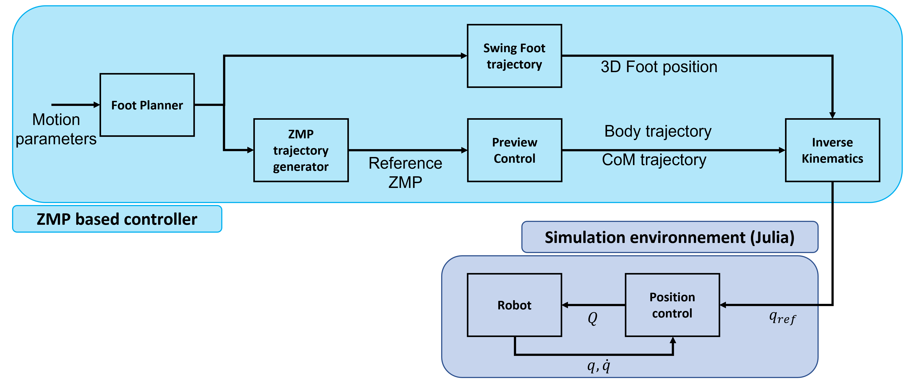
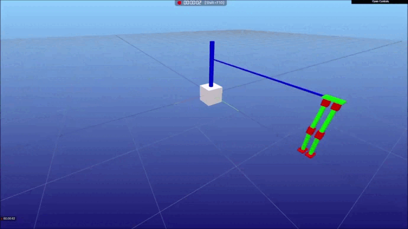

# Design and Control of a Biped Robot 

## Implementation of an ZMP based controller for a simple 8 D.o.F robot 

This project is part of another project called [Dionysos](https://github.com/dionysos-dev/Dionysos.jl) in order to benchmark the biped robot. This project is associated to the following  [thesis](https://dial.uclouvain.be/downloader/downloader_thesis.php?pid=thesis:40693&datastream=PDF_01&key=8b2cc138cd5db26d48602e804a9a548a
).
Every part of this project is sample code which shows how to do the following : 

* Generate the joint trajectories for a biped robot based on the ZMP stability criteria on a csv file 
* Read an URDF file 
* Create a robot visualiser 
* Simulate the biped robot on a well-controlled environment 

## Controller Structure 

The figure shows the intended structure of the implemented controller in open loop. The controller separated into 2 mains blocks : 
* ZMP based controller : 
    * Foot Planner, evaluates the landing position of the right and left foot.
    * Swing Foot Trajectory, determines the 3D position of the swing foot.
    * ZMP Trajectory Generator, defines the reference ZMP trajectory to remain within the support polygon.
    * CoM Trajectory Generator, computes the CoM trajectory and the hip body position based on the reference ZMP.
    * Inverse Kinematics, converts the local foot position in workspace coordinates intojoint space coordinates. 
* Simulation Environment : 
    * Position Control, a classical PID controller with dynamic compensation.
    * Robot, a virtual robot in a virtual environment 
    

## How to run this project 

This project has many examples, see [Examples](examples/) for further information.

## Actual Version 

This version of the project does not support a closed-loop system. In a short term, a closed-loop form will be developed to handle disturbed environment. 