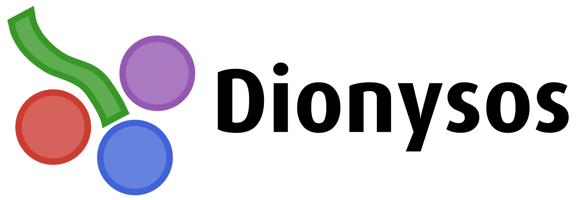

# Dionysos
<picture>
  <source srcset="assets/images/logo-dark.png" media="(prefers-color-scheme: dark)">
  
</picture>

| **Documentation & Paper** | **Build Status** | **Quality** |
|:-----------------:|:----------------:|:------------:|
| [![DOI][paper-img]][paper-url] [![][docs-latest-img]][docs-latest-url] [![][docs-stable-img]][docs-stable-url] | [![Build Status][build-img]][build-url] [![Codecov][codecov-img]][codecov-url] | [![Aqua QA][aqua-img]][aqua-url] |


[docs-stable-img]: https://img.shields.io/badge/docs-stable-blue.svg
[docs-latest-img]: https://img.shields.io/badge/docs-latest-blue.svg
[docs-stable-url]: https://dionysos-dev.github.io/Dionysos.jl/stable
[docs-latest-url]: https://dionysos-dev.github.io/Dionysos.jl/dev
[paper-img]: https://proceedings.juliacon.org/papers/10.21105/jcon.00160/status.svg
[paper-url]: https://doi.org/10.21105/jcon.00160

[build-img]: https://github.com/dionysos-dev/Dionysos.jl/actions/workflows/ci.yml/badge.svg?branch=master
[build-url]: https://github.com/dionysos-dev/Dionysos.jl/actions?query=workflow%3ACI
[codecov-img]: https://codecov.io/github/dionysos-dev/Dionysos.jl/coverage.svg
[codecov-url]: https://app.codecov.io/github/dionysos-dev/Dionysos.jl

[aqua-img]: https://juliatesting.github.io/Aqua.jl/dev/assets/badge.svg
[aqua-url]: https://github.com/JuliaTesting/Aqua.jl

**Dionysos** is a Julia framework for **correct-by-construction controller synthesis** through
symbolic (abstraction-based) control. Its guiding vision is **Control as a Service (CaaS)**: making certified
controller design an automated, on-demand capability rather than a bespoke, months-long expert effort.
It is the software of the ERC project
[Learning to Control](https://perso.uclouvain.be/raphael.jungers/content/erc-consolidator-grant) (L2C).

## Why Dionysos — Control as a Service (CaaS)

Controlling a complex system traditionally means a team of experts hand-crafting an ad hoc controller
over months, at significant cost. Dionysos pursues a different paradigm — **Control as a Service** —
turning controller design into an automated, on-demand pipeline that is accessible even to teams
without a dedicated control or IT department:

> **describe the system → select the specification → pick a solver → obtain a controller together with
> a formal certificate.**

You bring the model and the goal; Dionysos returns the controller and its certificate. Under the hood,
the system is *abstracted* into a finite-state automaton by discretizing its variables; a controller
is synthesized on that finite object with graph algorithms and then *concretized* back to the original
system with a formal guarantee. Dionysos is an **ecosystem, not a single algorithm**: every solver is
a [MathOptInterface](https://jump.dev/MathOptInterface.jl) optimizer driven through
[JuMP](https://jump.dev/JuMP.jl), so a control task can be re-solved, compared, and benchmarked by
*swapping the solver* rather than rewriting the model.

It solves reach-avoid, safety, reach-and-stay, and co-safe LTL specifications with a catalog of
solvers: uniform grid abstraction (SCOTS-style), uniform and lazy ellipsoidal abstractions,
hybrid-system abstraction, a PCLF bisimulation quotient, discrete-automaton synthesis, and
optimization-based solvers (Bemporad–Morari, branch and bound).

## Quick start

Describe a system and a specification in a JuMP model, pick the solver by choosing the optimizer, and
read back the controller:

```julia
using Dionysos, JuMP, StaticArrays

model = Model(Dionysos.Optimizer)

# State and input variables, with the initial state as `start`.
@variable(model, x_low[i] <= x[i = 1:3] <= x_upp[i], start = x0[i])
@variable(model, -1 <= u[1:2] <= 1)

# Dynamics, written with the `∂` (derivative) operator ...
@constraint(model, ∂(x[1]) == u[1] * cos(α + x[3]) * sec(α))
@constraint(model, ∂(x[2]) == u[1] * sin(α + x[3]) * sec(α))
@constraint(model, ∂(x[3]) == u[1] * tan(u[2]))

# ... and the target set, written with `final`.
@constraint(model, final(x[1]) in MOI.Interval(3.0, 3.6))
@constraint(model, final(x[2]) in MOI.Interval(0.3, 0.9))

# Solver parameters: discretization grids and time step.
set_attribute(model, "time_step", 0.3)
set_attribute(model, "state_grid", Dionysos.Mapping.GridFree(x0, hx))
set_attribute(model, "input_grid", Dionysos.Mapping.GridFree(u0, hu))

optimize!(model)
concrete_controller = get_attribute(model, "concrete_controller")
```

See the [Path planning example](https://dionysos-dev.github.io/Dionysos.jl/dev/generated/Path%20planning/)
for the complete, runnable version, and [Getting Started](https://dionysos-dev.github.io/Dionysos.jl/dev/generated/Getting%20Started/)
for the building blocks.

## Repository layout

| Path | Description |
| :--- | :--- |
| [`src/`](src/) | The `Dionysos` library (`Utils`, `System`, `Problem`, `Mapping`, `Symbolic`, `Optim`). |
| [`ext/`](ext/) | Package extensions behind optional dependencies (Plots, Symbolics, Spot, CSV, …). |
| [`problems/`](problems/) | Reusable benchmark problem library (path planning, DC-DC, pendulum, …). |
| [`scripts/`](scripts/) | Runnable case-study scripts, one folder per example. |
| [`docs/`](docs/) | Documentation site and examples. |
| [`test/`](test/) | Test suite, mirroring the `src/` layout. |

## Installation

Install [Julia](https://julialang.org/downloads/) (≥ 1.10), then add Dionysos from the Julia REPL:

```julia
import Pkg
Pkg.add("Dionysos")
```

## Documentation

The full documentation, including the manual, examples, and API reference, is available for the
[released version][docs-stable-url] and the [development version][docs-latest-url]. If Dionysos is
useful in your research, please cite the [JuliaCon paper][paper-url].

## Contributing

Contributions are welcome. Please open an [issue](https://github.com/dionysos-dev/Dionysos.jl/issues)
to report a bug or discuss a feature, and see the Developer Docs in the documentation for the setup,
conventions, and Git workflow.

## Acknowledgements

This project has received funding from the European Research Council (ERC) under the European Union's
Horizon 2020 research and innovation programme under grant agreement No 864017 - L2C.
