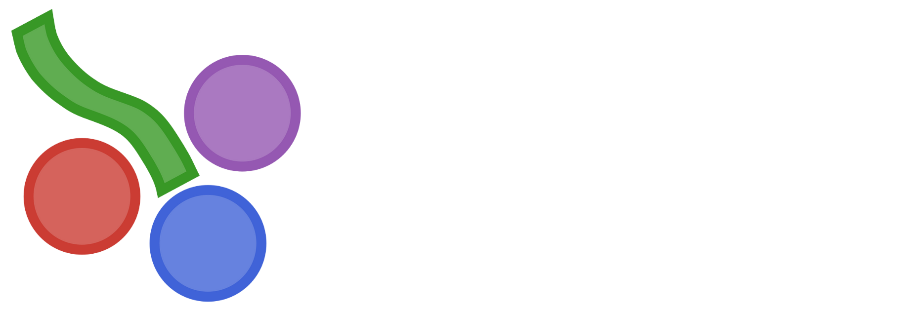
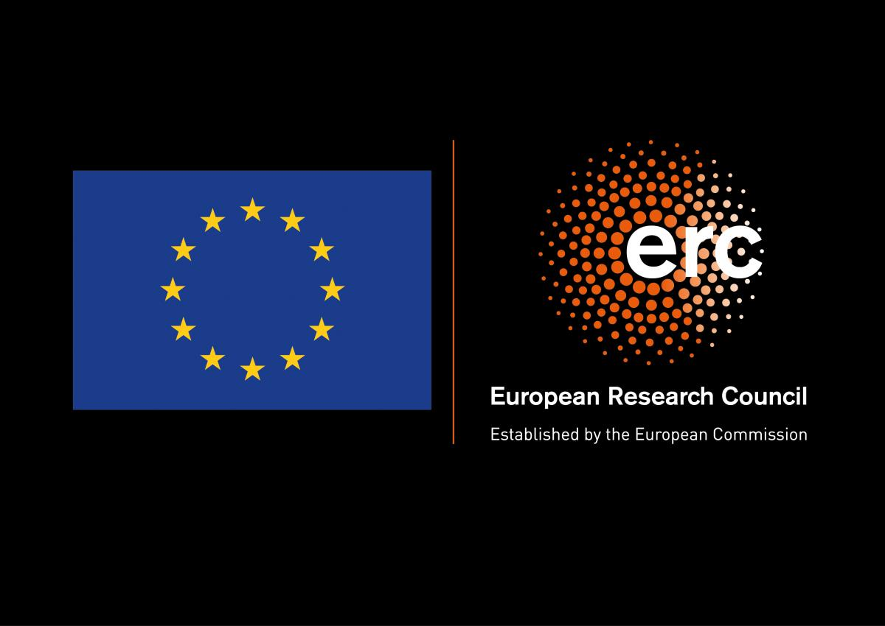

```@raw html


```

# Dionysos

[Dionysos](https://github.com/dionysos-dev/Dionysos.jl) is a Julia framework for **correct-by-construction
controller synthesis** through symbolic (abstraction-based) control. Its guiding vision is
**Control as a Service** — making certified controller design an automated, on-demand capability
instead of a bespoke, months-long expert effort. It is the software of the ERC
project [Learning to Control](https://perso.uclouvain.be/raphael.jungers/content/erc-consolidator-grant)
(L2C).

## What Dionysos does — Control as a Service

Designing a controller for a complex system traditionally requires a team of experts hand-crafting an
ad hoc controller over months. Dionysos pursues **Control as a Service**: turning that bespoke effort
into an automated, on-demand pipeline usable even without a dedicated control or IT department —

> **describe the system → select the specification → pick a solver → obtain a controller together with
> a formal certificate.**

You bring the model and the goal; Dionysos returns the controller and its certificate.

The underlying technique is **symbolic control**: the continuous system is *abstracted* into a
finite-state automaton by discretizing its variables, a controller is synthesized on that finite
object with graph algorithms (Dijkstra, A\*, fixed-point iterations), and it is then *concretized*
back to the original system with a formal guarantee. To fight the curse of dimensionality, a core
research direction of the toolbox is **smart / lazy abstractions** that co-design the abstraction and
the controller, computing only the part of the abstraction that is actually needed.

Dionysos is an **ecosystem, not a single algorithm**. Its value is a common interface — every solver
is a [MathOptInterface](https://jump.dev/MathOptInterface.jl) optimizer, driven through
[JuMP](https://jump.dev/JuMP.jl) — so a control task can be re-solved, compared, and benchmarked by
*swapping the solver* rather than rewriting the model.

## A control problem in Dionysos

A control problem is a pair `(𝒮, Σ)`:

- a **system** `𝒮` — a [`MathematicalSystems`](https://juliareach.github.io/MathematicalSystems.jl) or
  [`HybridSystems`](https://github.com/blegat/HybridSystems.jl) object describing the dynamics
  `ẋ = f(x, u)` and the state/input constraints;
- a **specification** `Σ` — a [`ProblemType`](@ref Dionysos.Problem.ProblemType) such as reach-avoid,
  safety, reach-and-stay, or co-safe LTL.

It is solved by an **optimizer** `𝒪` (an
[`AbstractOptimizer`](https://jump.dev/MathOptInterface.jl/stable/reference/models/#MathOptInterface.AbstractOptimizer)),
which returns a controller and its certificate.

## Current capabilities

- **Specifications**: reach-avoid optimal control, safety, reach-and-stay, and co-safe LTL, plus
  abstraction-only problems (alternating simulation, bisimulation quotient). See the
  [`Problem`](@ref Problem) reference.
- **Solvers**: uniform grid abstraction (SCOTS-style), uniform and lazy ellipsoidal abstractions,
  hybrid-system abstraction, a PCLF bisimulation quotient, discrete-automaton synthesis, and
  optimization-based solvers (Bemporad–Morari, branch and bound). See the [`Optim`](@ref Optim)
  reference and the [Manual](@ref Overview).
- **Interfaces**: a canonical [JuMP](https://jump.dev/JuMP.jl) frontend (`Model(Dionysos.Optimizer)`)
  and direct MathOptInterface access.

## Structure of the documentation

- The **Manual** explains abstraction-based control and how to use Dionysos as a user.
- **Getting Started** walks through the basic building blocks; start there to get familiar with the
  toolbox.
- The **Solvers** and **Utils** sections collect runnable examples.
- The **API Reference** documents every public symbol, grouped by module.
- The **Developer Docs** are for contributors.

## Need help?

If you need help, open an [issue](https://github.com/dionysos-dev/Dionysos.jl/issues) on GitHub.

## ERC sponsor

This project has received funding from the European Research Council (ERC) under the European Union's
Horizon 2020 research and innovation programme under grant agreement No 864017 - L2C.

```@raw html


```
