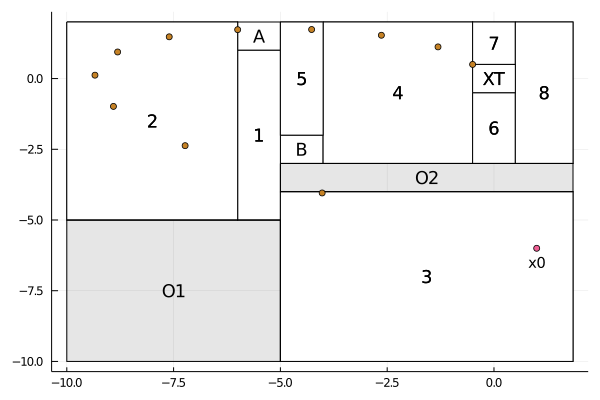

# Example: Gol, Lazar and Belta (2013)

[](https://mybinder.org/v2/gh/egidioln/Dionysos.jl/master?filepath=examples%2Fliterate%2Fgenerated%2Fliterate_gol_lazar_belta.ipynb)
[](https://nbviewer.jupyter.org/github/egidioln/Dionysos.jl/blob/master/examples/literate/generated/literate_gol_lazar_belta.ipynb)

This example was borrowed from [[1, Example VIII.A]](#1) and tackles
an optimal control for the hybrid system with state evolution governed by


The goal is to take the state vector toward a target set **XT** by visiting one of the squares
**A** or **B** and avoiding the obstacles **O1** and **O2**
First let us include the files defining the hybrid system and suitable solvers for this problem

```julia
include("../gol_lazar_belta.jl");
include("../../test/solvers.jl");
nothing #hide
```

Let us also import [[CDDLib]](https://github.com/JuliaPolyhedra/CDDLib.jl/tree/v0.6.3)
and [[GLPK]](https://github.com/jump-dev/GLPK.jl)

```julia
import CDDLib
import GLPK
```

At this point we import Dionysos

```julia
using Dionysos
```

Now we instatiate our system using the function provided by [[gol_lazar_belta.jl]](../gol_lazar_belta.jl)

```julia
system = gol_lazar_belta(CDDLib.Library());
nothing #hide
```

Then, we provide initial conditions (continuous and discrete states) to this system
and define **N** as the search depth, i.e., the number of allowed time steps.

```julia
x0 = [1.0, -6.0];
q0 = 3;

N = 11;
nothing #hide
```

We instantiate our Optimal Control Problem by defining the state and transition costs

```julia
state_cost = Fill(ZeroFunction(), nmodes(system))
transition_cost = QuadraticControlFunction(ones(1, 1))

problem = OptimalControlProblem(
        system,
        q0, x0,
        Fill(state_cost, N),
        Fill(Fill(transition_cost, ntransitions(system)), N),
        system.ext[:q_T],
        N
    );
nothing #hide
```

Finally, we select the method presented in [[2]](#2) as our optimizer and use it to solve the given problem

```julia
algo = optimizer_with_attributes(BemporadMorari.Optimizer,
        "continuous_solver" => qp_solver,
        "mixed_integer_solver" => miqp_solver,
        "indicator" => false,
        "log_level" => 0
    )

optimizer = MOI.instantiate(algo)
MOI.set(optimizer, MOI.RawParameter("problem"), problem)
@time MOI.optimize!(optimizer)
```

```
 36.174555 seconds (68.92 M allocations: 4.055 GiB, 3.86% gc time)

```

We check the termination status

```julia
termination = MOI.get(optimizer, MOI.TerminationStatus())
```

```
OPTIMAL::TerminationStatusCode = 1
```

the objective value

```julia
objective_value = MOI.get(optimizer, MOI.ObjectiveValue())
```

```
11.385062952226303
```

and recover the found continuous trajectory

```julia
xu = MOI.get(optimizer, ContinuousTrajectoryAttribute());
nothing #hide
```

A little bit of data visualization now:

```julia
using Plots
using Colors


##Auxiliary function for annotating
function text_in_set_plot!(pl, po, t; kws...)
    ##**Why is this solver for?**
    solver = optimizer_with_attributes(GLPK.Optimizer, "presolve" => GLPK.ON)
    plot!(pl, po; kws...)
    if t !== nothing
        c, r = hchebyshevcenter(hrep(po), solver, verbose=0)
        annotate!(pl, [(c..., text(t, 12))])
    end
end


##Initialize our canvas
p = Plots.plot(fmt = :png, fillcolor = :white)

##Show the discrete modes
for mode in states(system)
    t = (system.ext[:q_T] in [mode, mode + 11]) ? "XT" : (mode == system.ext[:q_A] ? "A" : (mode == system.ext[:q_B] ? "B" :
            mode <= 11 ? string(mode) : string(mode - 11)))
    text_in_set_plot!(p, stateset(system, mode), t, fillcolor = :white, linecolor = :black)
end

##Plot obstacles
for i in eachindex(system.ext[:obstacles])
    text_in_set_plot!(p, system.ext[:obstacles][i], "O$i", fillcolor = :black, fillalpha = 0.1)
end


##Initial state
scatter!(p, [x0[1]], [x0[2]])
annotate!(p, [(x0[1], x0[2] - 0.5, text("x0", 10))])

##Split the vector into x1 and x2
x1 = [xu.x[j][1] for j in eachindex(xu.x)]
x2 = [xu.x[j][2] for j in eachindex(xu.x)]

##Plot the trajectory
scatter!(p, x1, x2)
```


### References
<a id="1">[1]</a>
Gol, E. A., Lazar, M., & Belta, C. (2013). Language-guided controller synthesis for linear systems. IEEE Transactions on Automatic Control, 59(5), 1163-1176.

<a id="2">[2]</a>
Bemporad, A., & Morari, M. (1999). Control of systems integrating logic, dynamics, and constraints. Automatica, 35(3), 407-427.

---

*This page was generated using [Literate.jl](https://github.com/fredrikekre/Literate.jl).*

