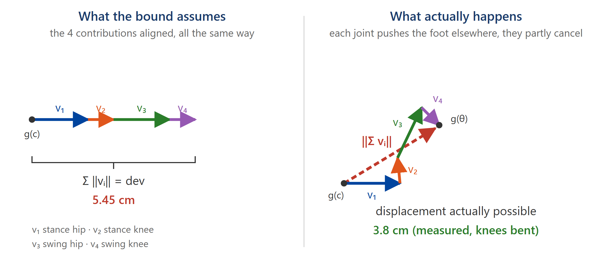

Answer to the question asked about the slide *Cartesian obstacles, pulled back to
joint space*. The sentence on the slide is compressed; here is what it means.

# The problem

The constraints are not on the state. They are on the **swing foot position**, a
nonlinear image of it:

$$g : \mathbb{R}^4 \to \mathbb{R}^2, \qquad \theta = (\theta_1,\theta_2,\theta_3,\theta_4)
\;\longmapsto\; \text{foot position}.$$

The abstraction does not reason about points, it reasons about **cells**. To decide
whether to keep or drop a cell $C$ of centre $c$ and half-widths $h_i/2$, we would like to
test the centre only. That is correct only if we know how far $g$ can move **inside** the
cell:

$$\forall \theta \in C : \qquad \lVert g(\theta) - g(c) \rVert_\infty \;\le\; \mathrm{dev}.$$

That quantity $\mathrm{dev}$ is what the slide calls the margin.

> Without it, testing the centre would be **wrong**: the preimage of an obstacle in joint
> space is a thin curved shell that crosses cells without containing their centres. The
> controller would walk straight through the obstacle.

# Where the inequality comes from

Write the variation along the segment joining $c$ to $\theta$:

$$g(\theta) - g(c) \;=\; \int_0^1 Dg\big(c + s(\theta - c)\big)\,(\theta - c)\, \mathrm{d}s
\;=\; \sum_{i=1}^{4} \underbrace{\left[\int_0^1 \frac{\partial g}{\partial \theta_i}\,\mathrm{d}s\right](\theta_i - c_i)}_{\textstyle v_i}$$

So the foot's total displacement is a **sum of four planar vectors** $v_1, v_2, v_3, v_4$,
one per joint: $v_i$ is "how much joint $i$ moves the foot".

Then two **nested** inequalities:

$$\lVert g(\theta) - g(c) \rVert_\infty
\;\underset{(b)}{\le}\; \sum_i \lVert v_i \rVert
\;\underset{(a)}{\le}\; \sum_i L_i \frac{h_i}{2} \;=:\; \mathrm{dev}.$$

**The whole sentence on the slide is about the difference between (a) and (b).**

# (a) The per-joint bound: $L_i$, and why it is *exact*

$L_i$ bounds $\lVert \partial g / \partial \theta_i \rVert$: it is the **lever arm**, the
distance from joint $i$ to the foot. A joint rotates everything below it, so the foot
travels at most the length of that sub-chain, per radian.

With $L_1 = 20.125$ cm (hip to knee) and $L_2 = 17.2$ cm (knee to foot), and writing

$$\rho(\alpha) \;:=\; \sqrt{L_1^2 + L_2^2 + 2 L_1 L_2 \cos\alpha}
\;\in\; [\,|L_1 - L_2|,\; L_1 + L_2\,],$$

the computation gives **exactly**:

| joint | $\lVert \partial g/\partial\theta_i \rVert$ | supremum | attained when |
| :-- | :-- | :-- | :-- |
| $\theta_1$ stance hip | $\rho(\theta_2)$ | $L_1 + L_2 = 37.3$ cm | $\theta_2 = 0$, knee straight |
| $\theta_2$ stance knee | $L_2$, constant | $L_2 = 17.2$ cm | always |
| $\theta_3$ swing hip | $\rho(\theta_4)$ | $L_1 + L_2 = 37.3$ cm | $\theta_4 = 0$, knee straight |
| $\theta_4$ swing knee | $L_2$, constant | $L_2 = 17.2$ cm | always |

**That is what "each $L_i$ is exact" means.** These are not crude over-estimates:

- for the knees ($\theta_2$, $\theta_4$) the norm equals $L_2$ **everywhere**, so there is
  strictly no loss;
- for the hips ($\theta_1$, $\theta_3$) the supremum $L_1 + L_2$ is **attained** as soon as
  the corresponding knee is straight, which does happen during the motion.

The only loss at this level is that $L_i$ is a **global** supremum: in a cell where the
knee is bent, the true sensitivity is slightly smaller (for instance $36.6$ cm instead of
$37.3$ cm at $\theta_2 = 0.4$ rad). That is marginal.

# (b) The sum: *this* is where the conservatism is

The inequality

$$\left\lVert \sum_i v_i \right\rVert \;\le\; \sum_i \lVert v_i \rVert$$

is the triangle inequality. It is **an equality only if the $v_i$ are all collinear and
point the same way.**

They are not. Moving the stance hip pushes the foot in a direction perpendicular to the
hip-to-foot segment; moving the swing hip pushes it in another; the two knees in two
others again. Those displacements **partly cancel**.

The bound, however, assumes the absolute worst case: *as if the four contributions all
added up in the same direction*. That is exactly what "adding the four as if they pointed
the same way" meant.

## Figure

{width=95%}

The four arrows have **exactly the same lengths** in both drawings: they are the same
$\lVert v_i \rVert$, bounded by the same $L_i h_i/2$. Only their **directions** change. On
the left, laid head to tail all the same way, they travel as far as is arithmetically
possible: that is $\mathrm{dev}$. On the right, oriented the way the kinematics actually
orients them, the path folds back on itself and the foot ends up much closer to $g(c)$:
that is the dashed red arrow.

The bound is the drawing on the left. Reality is the one on the right.

A second, smaller source of conservatism: we bound an **infinity** norm (the larger of the
$x$ and $y$ components) by a sum of **Euclidean** norms, and
$\lVert \cdot \rVert_\infty \le \lVert \cdot \rVert_2$.

# What it costs, measured

$\sum_i L_i = 2(L_1+L_2) + 2L_2 = 1.0905$ m, hence $\mathrm{dev} = 1.0905 \cdot dx/2$.

I compared that bound with the **true** maximal displacement inside the cell (400 000
samples per cell):

| $dx$ | bound $\mathrm{dev}$ | true max, leg extended | true max, knees bent |
| :-- | --: | --: | --: |
| 0.1 | 5.45 cm | 5.18 cm (**×1.05**) | 3.76 cm (**×1.45**) |
| 0.05 | 2.73 cm | 2.58 cm (**×1.06**) | 1.85 cm (**×1.48**) |

In other words: with the leg extended the bound is almost **tight** (5 % of slack); with
the knees bent it over-estimates by about 45 %. That is moderate. It is not the factor 4
that a "worst case of worst cases" reading might suggest, because inside a cell that small
the four contributions stay comparable in size and the geometry does not collapse.

# Why this is the safe direction

The margin is used to **remove** cells:

$$\text{remove } C \iff \big(g(c) \oplus [-\mathrm{dev}, \mathrm{dev}]^2\big) \cap O \ne \emptyset.$$

Over-estimating $\mathrm{dev}$ therefore removes *more* cells than necessary. Consequences:

- a **kept** cell satisfies $g(\theta) \notin O$ for **every** $\theta$ in it: the
  certificate is true;
- a failure reads "no controller **at this resolution**", never "false certificate".

This is also why the margin is a good infeasibility detector: at $dx = 0.1$ it is 5.45 cm,
which provably disconnects the free space around a 4 cm $\times$ 3 cm step; at $dx = 0.05$
it drops to 2.73 cm and the step becomes feasible.

# If the margin ever becomes the binding constraint

Two improvements, in order of simplicity:

1. **A per-cell bound instead of a global one.** Replace $L_i$ by
   $\sup_{\theta \in C} \lVert \partial g/\partial\theta_i \rVert$, which has a closed form
   here, since $\rho$ is monotone in $|\alpha|$. Gain: the 45 % of the "knees bent" row.
2. **Do not go through the sum of norms.** Bound
   $\sup_{\theta \in C} \lVert g(\theta) - g(c) \rVert$ directly by an interval evaluation
   of the full kinematics, which keeps the cancellation between the $v_i$ instead of
   throwing it away.

# In one sentence

> The $L_i$ are lever arms, and they are the true suprema: nothing is lost joint by joint.
> What is pessimistic is **adding** them. The triangle inequality pretends the four foot
> displacements all point the same way, when in reality they cancel each other in part.
> Measured, that costs between 5 % and 45 %, always on the safe side.
