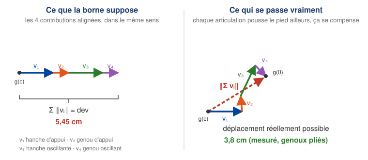

# La marge de Lipschitz du biped : pourquoi « chaque $L_i$ est exact, la borne est conservative »

Réponse à la question posée sur la slide *Cartesian obstacles, pulled back to joint
space*. La phrase de la slide est compacte ; voici ce qu'elle veut dire.

---

## 1. Le problème

Les contraintes ne portent pas sur l'état. Elles portent sur la **position du pied
oscillant**, qui est une image non linéaire de l'état :

$$g : \mathbb{R}^4 \to \mathbb{R}^2, \qquad \theta = (\theta_1,\theta_2,\theta_3,\theta_4)
\;\longmapsto\; \text{position du pied}.$$

Or l'abstraction ne raisonne pas sur des points, elle raisonne sur des **cellules**.
Pour décider si on garde ou si on jette une cellule $C$ de centre $c$ et de demi-largeurs
$h_i/2$, on aimerait ne tester que le centre. Ce n'est correct que si l'on sait de combien
$g$ peut bouger **à l'intérieur** de la cellule :

$$\forall \theta \in C : \qquad \lVert g(\theta) - g(c) \rVert_\infty \;\le\; \mathrm{dev}.$$

C'est cette quantité $\mathrm{dev}$ que la slide appelle la marge.

> Sans cette marge, tester le centre serait **faux** : la préimage d'un obstacle dans
> l'espace des angles est une coquille mince et courbe, qui traverse des cellules sans
> contenir leur centre. Le contrôleur passerait « à travers » l'obstacle.

---

## 2. D'où vient l'inégalité

On écrit la variation le long du segment qui joint $c$ à $\theta$ :

$$g(\theta) - g(c) \;=\; \int_0^1 Dg\big(c + s(\theta - c)\big)\,(\theta - c)\, \mathrm{d}s
\;=\; \sum_{i=1}^{4} \underbrace{\left[\int_0^1 \frac{\partial g}{\partial \theta_i}\,\mathrm{d}s\right](\theta_i - c_i)}_{\textstyle v_i}$$

Le déplacement total du pied est donc la **somme de quatre vecteurs** $v_1, v_2, v_3, v_4$
du plan, un par articulation : $v_i$ est « ce que l'articulation $i$ fait bouger le pied ».

Ensuite, deux inégalités **emboîtées** :

$$\lVert g(\theta) - g(c) \rVert_\infty
\;\underset{(b)}{\le}\; \sum_i \lVert v_i \rVert
\;\underset{(a)}{\le}\; \sum_i L_i \frac{h_i}{2} \;=:\; \mathrm{dev}.$$

**Toute la phrase de la slide porte sur la différence entre (a) et (b).**

---

## 3. (a) La borne par articulation : $L_i$, et pourquoi elle est *exacte*

$L_i$ majore $\lVert \partial g / \partial \theta_i \rVert$ : c'est le **bras de levier**,
la distance de l'articulation $i$ au pied. Une articulation fait tourner tout ce qui est
en dessous d'elle, donc le pied se déplace au plus de la longueur de ce sous-bras, par
radian.

Avec $L_1 = 20{,}125$ cm (hanche → genou) et $L_2 = 17{,}2$ cm (genou → pied), le calcul
donne **exactement** :

| articulation | $\lVert \partial g/\partial\theta_i \rVert$ | sup | atteint quand |
| :-- | :-- | :-- | :-- |
| $\theta_1$ hanche d'appui | $\sqrt{L_1^2 + L_2^2 + 2L_1L_2\cos\theta_2}$ | $L_1 + L_2 = 37{,}3$ cm | $\theta_2 = 0$, genou tendu |
| $\theta_2$ genou d'appui | $L_2$ (constant) | $L_2 = 17{,}2$ cm | toujours |
| $\theta_3$ hanche oscillante | $\sqrt{L_1^2 + L_2^2 + 2L_1L_2\cos\theta_4}$ | $L_1 + L_2 = 37{,}3$ cm | $\theta_4 = 0$, genou tendu |
| $\theta_4$ genou oscillant | $L_2$ (constant) | $L_2 = 17{,}2$ cm | toujours |

**C'est ça, « chaque $L_i$ est exact ».** Ce ne sont pas des majorations grossières :

- pour les genoux ($\theta_2$, $\theta_4$) la norme vaut $L_2$ **partout**, il n'y a
  strictement aucune perte ;
- pour les hanches ($\theta_1$, $\theta_3$) le sup $L_1 + L_2$ est **atteint** dès que le
  genou correspondant est tendu — ce qui arrive réellement dans le mouvement.

La seule perte à ce niveau est que $L_i$ est un sup **global** : dans une cellule où le
genou est plié, la vraie sensibilité est un peu plus petite (par exemple $36{,}6$ cm au
lieu de $37{,}3$ cm pour $\theta_2 = 0{,}4$ rad). C'est marginal.

---

## 4. (b) La somme : c'est *là* qu'est la conservativité

L'inégalité

$$\left\lVert \sum_i v_i \right\rVert \;\le\; \sum_i \lVert v_i \rVert$$

est l'inégalité triangulaire. Elle est **une égalité seulement si les $v_i$ sont tous
colinéaires et de même sens.**

Or ils ne le sont pas. Bouger la hanche d'appui pousse le pied dans une direction
perpendiculaire au segment hanche → pied ; bouger la hanche oscillante le pousse dans une
autre ; les deux genoux dans deux autres encore. Ces déplacements **se compensent
partiellement**.

La borne, elle, suppose le pire cas absolu : *comme si les quatre contributions
s'additionnaient toutes dans la même direction*. Voilà exactement ce que voulait dire
« adding the four as if they pointed the same way ».

### Schéma

Les quatre flèches ont **exactement la même longueur** dans les deux dessins : ce sont les
mêmes $\lVert v_i \rVert$, bornés par les mêmes $L_i h_i/2$. Seules leurs **directions**
changent. À gauche, mises bout à bout dans le même sens, elles vont aussi loin qu'il est
arithmétiquement possible : c'est $\mathrm{dev}$. À droite, orientées comme la cinématique
les oriente vraiment, le trajet se replie sur lui-même et le pied finit beaucoup plus près
de $g(c)$ : c'est la flèche rouge en pointillés.

La borne, c'est le dessin de gauche. La réalité, c'est celui de droite.

Une deuxième source, plus petite, de conservativité : on borne une norme **infinie**
(la plus grande des deux composantes $x$, $y$) par une somme de normes **euclidiennes**,
et $\lVert \cdot \rVert_\infty \le \lVert \cdot \rVert_2$.

---

## 5. Combien ça coûte, mesuré

$\sum_i L_i = 2(L_1+L_2) + 2L_2 = 1{,}0905$ m, donc $\mathrm{dev} = 1{,}0905 \cdot dx/2$.

J'ai comparé cette borne au **vrai** déplacement maximal dans la cellule (400 000 tirages
par cellule) :

| $dx$ | borne $\mathrm{dev}$ | vrai max, jambe tendue | vrai max, genoux pliés |
| :-- | --: | --: | --: |
| 0,1 | 5,45 cm | 5,18 cm (**×1,05**) | 3,76 cm (**×1,45**) |
| 0,05 | 2,73 cm | 2,58 cm (**×1,06**) | 1,85 cm (**×1,48**) |

Autrement dit : quand la jambe est tendue, la borne est presque **serrée** (5 % de marge) ;
quand les genoux sont pliés, elle sur-estime d'environ 45 %. C'est modéré — ce n'est pas
un facteur 4 comme le « pire cas des pires cas » pourrait le laisser craindre, parce que
dans une cellule aussi petite les quatre contributions restent de tailles comparables et
la géométrie ne s'écroule pas.

---

## 6. Pourquoi c'est le bon sens de conservativité

La marge sert à **retirer** des cellules :

$$\text{on retire } C \iff \big(g(c) \oplus [-\mathrm{dev}, \mathrm{dev}]^2\big) \cap O \ne \emptyset.$$

Sur-estimer $\mathrm{dev}$ retire donc *plus* de cellules que nécessaire. Conséquences :

- une cellule **gardée** vérifie $g(\theta) \notin O$ pour **tout** $\theta$ dedans : le
  certificat est vrai ;
- un échec se lit « pas de contrôleur **à cette résolution** », jamais « certificat faux ».

C'est aussi pour ça que la marge est un bon détecteur d'infaisabilité : à $dx = 0{,}1$ elle
vaut 5,45 cm, ce qui déconnecte prouvablement l'espace libre autour d'une marche de
4 cm × 3 cm ; à $dx = 0{,}05$ elle tombe à 2,73 cm et le pas devient faisable.

---

## 7. Si un jour la marge devient le facteur limitant

Deux améliorations, par ordre de simplicité :

1. **Borne par cellule au lieu de globale.** Remplacer $L_i$ par
   $\sup_{\theta \in C} \lVert \partial g/\partial\theta_i \rVert$, qui se calcule en forme
   fermée ici ($\sqrt{L_1^2+L_2^2+2L_1L_2\cos\theta_2}$ est monotone en $|\theta_2|$). Gain :
   les 45 % de la ligne « genoux pliés ».
2. **Ne pas passer par la somme des normes.** Majorer directement
   $\sup_{\theta \in C} \lVert g(\theta) - g(c) \rVert$ par une évaluation d'intervalle sur
   la cinématique complète, ce qui garde la compensation entre les $v_i$ au lieu de la jeter.

---

## En une phrase

> Les $L_i$ sont les bras de levier, et ce sont les vrais suprema — rien n'est perdu
> articulation par articulation. Ce qui est pessimiste, c'est de les **additionner** :
> l'inégalité triangulaire fait comme si les quatre déplacements du pied pointaient tous
> dans la même direction, alors qu'en réalité ils se compensent. Mesuré, ça coûte entre
> 5 % et 45 %, toujours du côté sûr.
