## Abstraction-based control

Discretize the state space, build a finite automaton whose transitions
**over-approximate** the dynamics, synthesize on it, concretize the
controller.

:::: {.columns}
::: {.column .fragment width="27%"}
**Difficulties**

::: {style="font-size: 0.75em;"}
- curse of dimensionality: exponential in the state dimension
- spurious non-determinism from over-approximation: sound but not complete
- the abstraction is built up front, over the whole state space, even where it is never used
- requires a model with valid bounds (Jacobian, growth): a wrong bound voids the guarantee
- controllers are lookup tables: storage grows with the grid
:::
:::
::: {.column width="42%"}
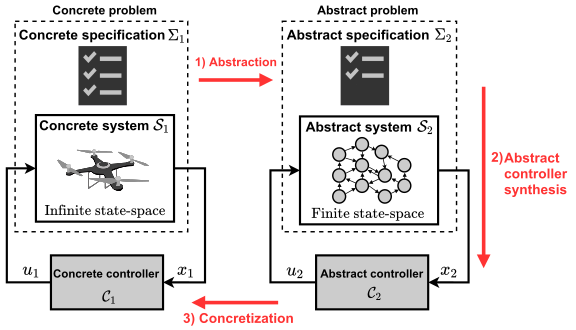{fig-align="center" height=330 style="margin-top: 2.5em;"}
:::
::: {.column .fragment width="31%"}
**Advantages**

::: {style="font-size: 0.75em;"}
- enforces complex specifications (LTL, reach-avoid-stay)
- correct by construction: controller + certificate
- systematic, model-agnostic (nonlinear, hybrid, disturbed)
- worst-case disturbances handled natively (a game on the automaton)
- returns the winning set: you know *where* the guarantee holds
- non-convex constraints and obstacles at no extra cost
- finite object: graph algorithms apply
- offline synthesis, cheap runtime lookup
- decentralized / parallel computation
:::
:::
::::

::: {.fragment style="font-size: 0.70em;"}
**Research directions:** multi-layered abstractions, abstraction and controller co-design, lazy computation, local state-feedback controllers.
:::

## Software architecture

A problem is a pair (system $\mathcal{S}$, specification $\Sigma$); a solver
is a `MathOptInterface.AbstractOptimizer`. **Swap the solver, keep the
problem**: a comparison framework, not one algorithm.

```{mermaid}
%%| fig-align: center
flowchart LR
  U[Utils] --> Sy[System] --> P[Problem] --> M[Mapping] --> S[Symbolic] --> O["Optim<br/>solver catalog"]
  O --> D["direct MOI<br/><i>low level, full control</i>"]
  O --> W["Wrapper: JuMP model<br/><i>high level, problem inferred</i>"]
  style D fill:#eef3fa,stroke:#1a3a6b
  style W fill:#eef3fa,stroke:#1a3a6b
```

::: {.incremental style="font-size: 0.70em;"}
- `Utils`: sets ([LazySets.jl]{.pkg}), exact ellipsoid kernels, PCLF subroutines, scalar optimization, data structures
- `System`: plants ([MathematicalSystems.jl]{.pkg}, [HybridSystems.jl]{.pkg}), reachable-set over-approximations, controllers, closed-loop engine
- `Problem`: the specifications (reach-avoid, safety, reach-and-stay, co-safe LTL)
- `Mapping`: discretization (grids, cells, INNER/OUTER/CENTER inclusion, periodic, multi-level)
- `Symbolic`: finite automata, abstraction construction (threaded, distributed), time and mode lifts
- `Optim`: one MOI optimizer per algorithm (uniform grid, ellipsoids, lazy, hybrid, discrete, trajectory generation + certification, PCLF quotient)
- `Wrapper`: the JuMP front-end (model IR, role inference, solver selection)
:::

::: {style="font-size: 0.70em;"}
Two entry styles, same solvers and statuses: a JuMP model (user friendly), or
direct MOI on one family optimizer (research scripts, benchmarks). Ecosystem:
[MathematicalSystems.jl]{.pkg} / [HybridSystems.jl]{.pkg}, [LazySets.jl]{.pkg},
[JuMP.jl]{.pkg} / [MathOptInterface.jl]{.pkg}, [Spot.jl]{.pkg}.
:::

## Example: pendulum swing-up (getting-started)

:::: {.columns}
::: {.column width="50%"}
```{.julia style="font-size: 0.60em; line-height: 1.12; margin-top: 3.5em;"}
model = Model(Dionysos.Optimizer)

## System
@variable(model, -π ≤ x1 ≤ π)
@variable(model, -10 ≤ x2 ≤ 10)
@variable(model, -3 ≤ u ≤ 3)
@constraint(model, ∂(x1) == x2)
@constraint(model, ∂(x2) == -(g/l)*sin(x1) + u)

## Specification
upright = LazySets.Hyperrectangle(;
    low = [π - 15π/180, -1.0], high = [π + 15π/180, 1.0])
@constraint(model, [x1, x2] in EventuallyAlways(upright))
@constraint(model, [x1] ∉ MOI.HyperRectangle([-π + 16π/180], [-π + 38π/180]))

## Solver settings: the abstraction
set_attribute(model, "time_step", 0.1)
set_attribute(model, "jacobian_bound", u -> SMatrix{2,2}(0.0, g/l, 1.0, 0.0))
h = SVector(3π/180, 0.05)
set_attribute(model, "state_grid", MP.GridFree(SVector(-π + h[1]/2, 0.0), h))
set_attribute(model, "input_grid", MP.GridFree(SVector(0.0), SVector(0.3)))
set_attribute(model, "use_periodic_mapping", true)
set_attribute(model, "periodic_dims", SVector(1))
set_attribute(model, "periodic_periods", SVector(2π))

## Solve, then run the closed loop
optimize!(model)
x0 = SVector(0.0, 0.0)
trajectory = Dionysos.simulate(model, x0; nsteps = 120)
```
:::
::: {.column width="50%"}
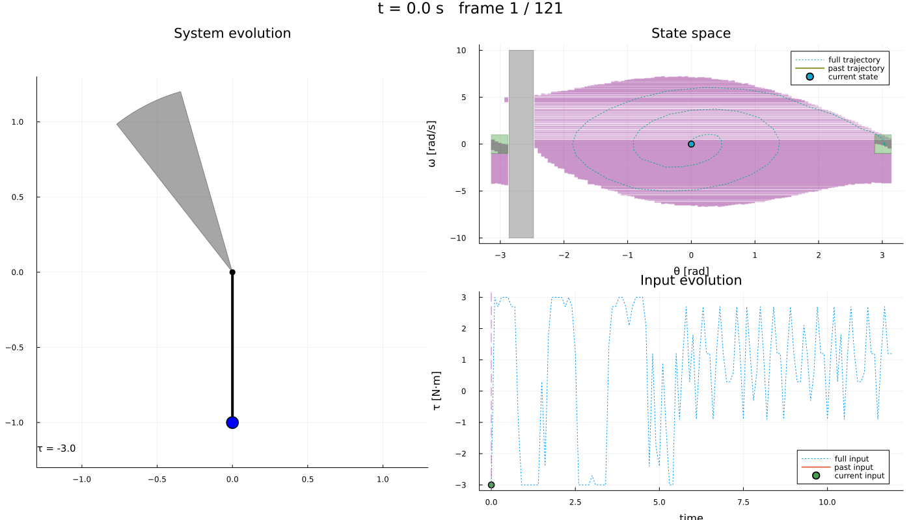{height=420}

::: {style="font-size: 0.66em;"}
Reach **and stay** at the unstable equilibrium; periodic angle (`x1` wraps
every 2π); forbidden band (black); torque too weak for a direct lift.
Output: a controller and its **certificate**, the winning set (purple).
:::
:::
::::

## Work since June

::: {style="text-align: center; margin-bottom: 0.2em;"}
**25 PRs · 519 files · +60k/−18k lines · 34 issues closed**
:::

::: {style="transform: scale(0.74); transform-origin: top center;"}
```{mermaid}
%%| fig-align: center
timeline
    July : v0.2 refactor of Utils, System, Problem, Mapping : sets are LazySets, one solver API : repository reorganization
    Early August : composable lifts (clock, mode) : JuMP front-end rebuilt : reach-and-stay specification : documentation rewritten : tests revised, Aqua.jl in CI
    Aug-Sep : trajectory certification pipeline : robust control and verification : biped robot speed control : adaptive cruise control benchmark : PCLF quotients (HSCC 2027)
    End September : release v0.2
```
:::

# v0.2 refactor {.section-slide}

## What the refactor changed

::: {.vbody}
:::: {.columns .vcenter}
::: {.column width="58%"}
::: {style="font-size: 0.64em;"}
- **Every module rewritten.** `Utils → System → Problem → Mapping → Symbolic →
  Optim → Wrapper`: one responsibility each, one dependency direction, no
  cycles.
- **Redundancy removed.** No Dionysos set type, no home-grown grid or domain
  code, no parallel controller hierarchies. Sets are [LazySets.jl]{.pkg},
  dynamics are [MathematicalSystems.jl]{.pkg} or [HybridSystems.jl]{.pkg}.
- **One API.** Every solver is an MOI optimizer: same attributes, same status,
  swappable without touching the model.
- **Repository reorganized.** `problems/`, `examples/`, `research/`; deprecated
  scripts and dead code deleted.
- **Documentation rewritten.** Manual, two tiers of examples, `@autodocs`
  reference, a written conventions guide. The build fails on any missing
  docstring.
- **Tests rebuilt.** Shared harness, every file runs standalone, fast and full
  tiers, contract tests on the previously uncovered solvers. Coverage at 85 %.
  Every phase was gated by **byte-identical regression fingerprints**, 9 705 631
  grid transitions among them.
- **[Aqua.jl]{.pkg} added to CI.** An automatic package-quality audit: type
  piracy, method ambiguities, undeclared or stale dependencies, missing compat
  bounds. It runs on every push, so nobody has to remember to check.
- **34 issues closed.**
:::
:::
::: {.column width="42%"}
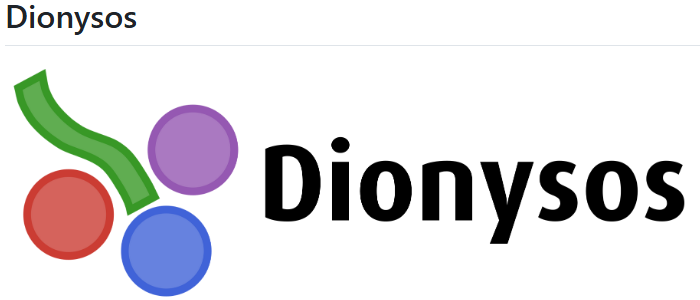{fig-align="center" width="82%"}
:::
::::

{fig-align="center" width="72%"}

::: {style="font-size: 0.56em; text-align: center; margin-top: -0.4em;"}
The README badges are the state of the package, re-checked on every push: docs
built, CI green, coverage measured, Aqua clean.
:::
:::

## Standing on the Julia ecosystem

::: {.vbody}
:::: {.columns .vcenter}
::: {.column width="55%"}
```{=html}
<svg viewBox="0 0 700 440" style="width:100%; height:auto;" xmlns="http://www.w3.org/2000/svg">
  <g stroke="#c9d3e4" stroke-width="1.6">
    <line x1="350" y1="220" x2="350" y2="65"/>
    <line x1="350" y1="220" x2="350" y2="375"/>
    <line x1="350" y1="220" x2="100" y2="220"/>
    <line x1="350" y1="220" x2="600" y2="220"/>
    <line x1="350" y1="220" x2="173" y2="110"/>
    <line x1="350" y1="220" x2="527" y2="110"/>
    <line x1="350" y1="220" x2="173" y2="330"/>
    <line x1="350" y1="220" x2="527" y2="330"/>
  </g>
  <g font-family="inherit" font-size="15" fill="#9558b2" text-anchor="middle">
    <g stroke="#d9c7ea" stroke-width="1.4" fill="#f7f2fb">
      <rect x="250" y="50"  width="200" height="30" rx="15"/>
      <rect x="262" y="360" width="176" height="30" rx="15"/>
      <rect x="60"  y="205" width="80"  height="30" rx="15"/>
      <rect x="545" y="205" width="110" height="30" rx="15"/>
      <rect x="98"  y="95"  width="150" height="30" rx="15"/>
      <rect x="468" y="95"  width="118" height="30" rx="15"/>
      <rect x="93"  y="315" width="160" height="30" rx="15"/>
      <rect x="456" y="315" width="142" height="30" rx="15"/>
    </g>
    <text x="350" y="70">MathematicalSystems.jl</text>
    <text x="350" y="380">MathOptInterface.jl</text>
    <text x="100" y="225">JuMP.jl</text>
    <text x="600" y="225">LazySets.jl</text>
    <text x="173" y="115">HybridSystems.jl</text>
    <text x="527" y="115">Polyhedra.jl</text>
    <text x="173" y="335">DataStructures.jl</text>
    <text x="527" y="335">StaticArrays.jl</text>
  </g>
  <ellipse cx="350" cy="220" rx="94" ry="46" fill="#1a3a6b"/>
  <text x="350" y="227" font-size="24" font-weight="700" fill="#ffffff" text-anchor="middle">Dionysos</text>
</svg>
```
:::
::: {.column width="45%"}
::: {style="font-size: 0.62em;"}
- Nothing is re-implemented if the ecosystem already has it. Sets, polyhedra,
  dynamics, the solver interface: all upstream, all standard, so a user already
  knows half the API before opening the manual.
- **Package extensions.** Seven optional features sit behind `[weakdeps]`:
    - [Plots.jl]{.pkg}, [Makie.jl]{.pkg}: the plot recipes and the animated
      dashboards
    - [Symbolics.jl]{.pkg} + [IntervalArithmetic.jl]{.pkg}: Jacobians and
      growth bounds derived from the model
    - [Spot.jl]{.pkg}: co-safe LTL formulas and their automata
    - [MathOptSymbolicAD.jl]{.pkg}: compiling the front-end `∂` dynamics
    - [CSV.jl]{.pkg} + [DataFrames.jl]{.pkg}: exporting controllers and
      benchmark tables
    - [RigidBodyDynamics.jl]{.pkg}: the multibody robot models
- `using Dionysos` loads none of them. The extension activates itself when the
  user loads the package it needs, so the install stays light and precompilation
  stays short.
- Every dependency carries a compat bound, audited by [Aqua.jl]{.pkg}.
:::
:::
::::
:::

# New features {.section-slide}

## Sets are LazySets

::: {style="font-size: 0.82em;"}
- **No Dionysos set type remains**: every set in the toolbox is a
  [LazySets.jl]{.pkg} object, end-to-end (boxes, ellipsoids with $Q = P^{-1}$,
  zonotopes, balls, lazy unions, set differences).
- Any bounded `LazySet` flows through discretization, specifications and
  plots, here combined with a co-safe LTL formula:
:::

:::: {.columns}
::: {.column width="52%"}
```{.julia style="font-size: 0.65em; line-height: 1.12; margin-top: 0.2em;"}
import LazySets; using Spot    ## Spot: the ltl"..." formulas
const UT = Dionysos.Utils

## System: a 2-D integrator
model = Model(Dionysos.Optimizer)
@variable(model, -5 ≤ x1 ≤ 5); @variable(model, -5 ≤ x2 ≤ 5)
@variable(model, -1 ≤ u1 ≤ 1); @variable(model, -1 ≤ u2 ≤ 1)
@constraint(model, ∂(x1) == u1)
@constraint(model, ∂(x2) == u2)

## Specification: labelled regions + a co-safe formula
hazard = LazySets.UnionSetArray([        ## lazy union
    LazySets.Zonotope([-0.5, 0.0], G),
    LazySets.Hyperrectangle(;
        low = [1.0, -3.2], high = [2.2, -0.8])])
waypoint = LazySets.Ellipsoid([-3.0, 3.2], Q)
goal = UT.set_minus(                     ## non-convex
    LazySets.Hyperrectangle(;
        low = [2.4, 2.2], high = [4.2, 4.2]),
    LazySets.Ball2([2.4, 3.2], 0.9))
@constraint(model, wp, [x1, x2] in Label(waypoint))
@constraint(model, gl, [x1, x2] in Label(goal))
@constraint(model, hz, [x1, x2] in Label(hazard))
@specification(model, ltl"F(wp & F(gl)) & G(!hz)")

## Solver settings, solve, closed loop
set_attribute(model, "time_step", 0.3)
set_attribute(model, "state_grid",
    MP.GridFree(SVector(0.0, 0.0), SVector(0.2, 0.2)))
## + input grid, jacobian bound
optimize!(model)
x0 = SVector(-3.5, -3.5)
trajectory = Dionysos.simulate(model, x0; nsteps = 200)
```
:::
::: {.column width="48%"}
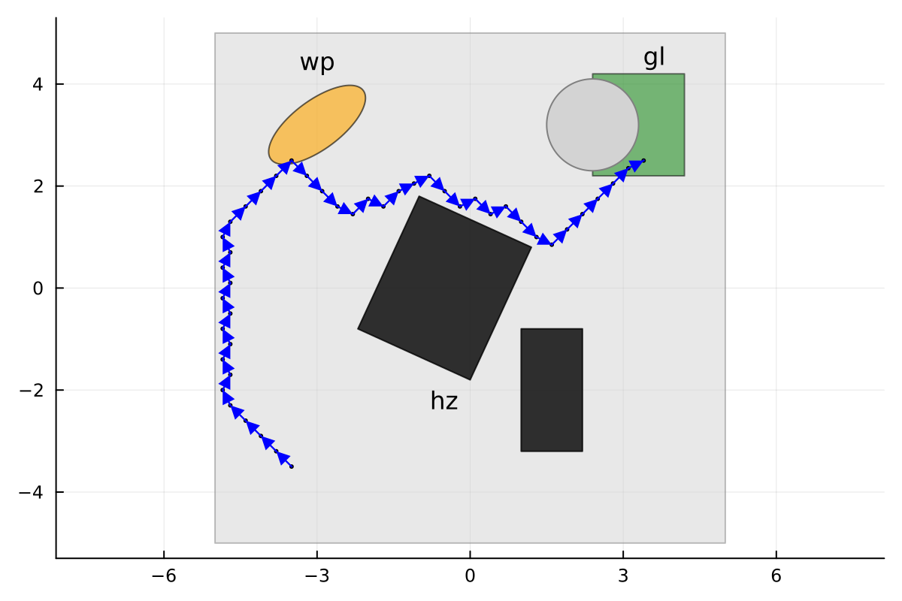{height=340 style="margin-top: 2.4em;"}
:::
::::

## Explicit or implicit: two independent choices

:::: {.columns .vtop}
::: {.column width="53%"}
::: {style="font-size: 0.68em;"}
The abstraction needs a bijection **integer label $\leftrightarrow$ grid pos**,
and a way to answer *is this pos a state of my set?*

- **Explicit.** Walk the domain once, give an id to each admissible pos, keep
  both directions in a `Dict` and a `Vector`. Membership is a lookup; any
  shape, holes included.
- **Implicit.** Take a **box covering** the domain, number **all** its pos
  row-major, store **nothing**: the id is arithmetic. Membership is decided
  **lazily** by [LazySets.jl]{.pkg}, the centre for `CENTER`, every corner for
  `INNER`/`OUTER`.

Same choice for the *mapping* (`use_implicit_mapping`) and for a *state set*
(`use_implicit_stateset`), independently.
:::

```{=html}
<svg viewBox="0 0 620 250" style="width:100%; height:auto; display:block; margin:0.4em auto 0;" xmlns="http://www.w3.org/2000/svg">
  <text x="120" y="14" font-size="15" font-weight="600" fill="#1a3a6b" text-anchor="middle">explicit</text>
  <text x="480" y="14" font-size="15" font-weight="600" fill="#1a3a6b" text-anchor="middle">implicit</text>

  <rect x="150" y="27" width="11" height="11" fill="#ccf0ff" stroke="#8fa8c8"/>
  <text x="166" y="37" font-size="12" fill="#555">domain</text>
  <rect x="222" y="27" width="11" height="11" fill="#222"/>
  <text x="238" y="37" font-size="12" fill="#555">obstacle</text>
  <rect x="300" y="27" width="11" height="11" fill="#ffffff" stroke="#ccc"/>
  <text x="316" y="37" font-size="12" fill="#555">outside the domain</text>

  <g fill="#ccf0ff">
    <rect x="60" y="52" width="120" height="30"/>
    <rect x="30" y="82" width="60" height="60"/><rect x="150" y="82" width="60" height="60"/>
    <rect x="60" y="142" width="120" height="30"/>
  </g>
  <rect x="90" y="82" width="60" height="60" fill="#222"/>
  <g stroke="#c8d6e8" stroke-width="1" fill="none">
    <path d="M30 52h180M30 82h180M30 112h180M30 142h180M30 172h180"/>
    <path d="M30 52v120M60 52v120M90 52v120M120 52v120M150 52v120M180 52v120M210 52v120"/>
  </g>
  <g font-size="13" fill="#1a3a6b" text-anchor="middle">
    <text x="75" y="72">1</text><text x="105" y="72">2</text><text x="135" y="72">3</text><text x="165" y="72">4</text>
    <text x="45" y="102">5</text><text x="75" y="102">6</text><text x="165" y="102">7</text><text x="195" y="102">8</text>
    <text x="45" y="132">9</text><text x="75" y="132">10</text><text x="165" y="132">11</text><text x="195" y="132">12</text>
    <text x="75" y="162">13</text><text x="105" y="162">14</text><text x="135" y="162">15</text><text x="165" y="162">16</text>
  </g>

  <g fill="#ccf0ff">
    <rect x="420" y="52" width="120" height="30"/>
    <rect x="390" y="82" width="60" height="60"/><rect x="510" y="82" width="60" height="60"/>
    <rect x="420" y="142" width="120" height="30"/>
  </g>
  <rect x="450" y="82" width="60" height="60" fill="#222"/>
  <g stroke="#c8d6e8" stroke-width="1" fill="none">
    <path d="M390 52h180M390 82h180M390 112h180M390 142h180M390 172h180"/>
    <path d="M390 52v120M420 52v120M450 52v120M480 52v120M510 52v120M540 52v120M570 52v120"/>
  </g>
  <g font-size="13" fill="#1a3a6b" text-anchor="middle">
    <text x="435" y="72">2</text><text x="465" y="72">3</text><text x="495" y="72">4</text><text x="525" y="72">5</text>
    <text x="405" y="102">7</text><text x="435" y="102">8</text><text x="525" y="102">11</text><text x="555" y="102">12</text>
    <text x="405" y="132">13</text><text x="435" y="132">14</text><text x="525" y="132">17</text><text x="555" y="132">18</text>
    <text x="435" y="162">20</text><text x="465" y="162">21</text><text x="495" y="162">22</text><text x="525" y="162">23</text>
  </g>
  <g font-size="13" fill="#bbb" text-anchor="middle">
    <text x="405" y="72">1</text><text x="555" y="72">6</text>
    <text x="405" y="162">19</text><text x="555" y="162">24</text>
  </g>
  <g font-size="13" fill="#ffa87d" text-anchor="middle">
    <text x="465" y="102">9</text><text x="495" y="102">10</text>
    <text x="465" y="132">15</text><text x="495" y="132">16</text>
  </g>
  <rect x="388" y="50" width="184" height="124" fill="none" stroke="#c0392b" stroke-width="2" stroke-dasharray="6 4"/>
  <text x="480" y="188" font-size="12" fill="#c0392b" text-anchor="middle">the covering box</text>

  <g font-size="13.5" fill="#333" text-anchor="middle">
    <text x="120" y="206">only the 16 domain pos get an id</text>
    <text x="480" y="208">all 24 pos of the box get an id</text>
  </g>
  <g font-size="13" fill="#666" text-anchor="middle">
    <text x="120" y="228">“is it a state?” → look in the table</text>
    <text x="480" y="230">“is it a state?” → ask LazySets</text>
  </g>
</svg>
```
:::
::: {.column width="47%"}
::: {style="font-size: 0.68em;"}
Concrete state $\leftrightarrow$ pos is the same on both sides, plain grid
arithmetic. Only the last hop differs:
:::

::: {style="font-size: 0.62em;"}
| | pos $\to$ label | label $\to$ pos |
| :-- | :-- | :-- |
| explicit | `pos2id[pos]`, `nothing` if absent | `id2pos[q]` |
| implicit | $1 + \sum_d (\mathrm{pos}_d - \min_d)\,s_d$ | $\mathrm{pos}_d = \min_d + \big\lfloor \tfrac{q-1}{s_d} \big\rfloor \bmod n_d$ |
:::

::: {style="font-size: 0.6em; margin-top: -0.2em;"}
$n_d$: cells of the box along axis $d$.

$s_d$: the row-major stride, $s_1 = 1$ and $s_d = n_1 \cdots n_{d-1}$.
:::

::: {style="font-size: 0.68em; margin-top: 0.7em;"}
A table access that had to be built, against a handful of integer operations on
strides. Path planning, 3-D, grid 0.2, same problem and same answer:
:::

::: {style="font-size: 0.72em;"}
| | labels | mapping | end to end |
| :-- | --: | --: | --: |
| explicit | 26 285 | 2.69 MB | 97.3 s |
| implicit | 32 585 | **144 B** | **18.9 s** |
:::

::: {style="font-size: 0.68em; margin-top: 0.7em;"}
- The box names **more** pos, 32 585 against 26 285: those the walls carved
  away are numbered too.
- In exchange, no table to build, grow or probe, and no tuple hashing in the
  abstraction loop.
- Explicit still wins when the domain is a small part of its bounding box.
:::
:::
::::

## Deployment: a Julia control server

::: {.vbody style="min-height: 605px;"}
:::: {.columns .vtop}
::: {.column width="50%"}
::: {style="font-size: 0.66em;"}
Synthesis is offline and expensive; running the controller is online and must
be cheap. So the two are **separated by a file**.

- Dionysos synthesizes, the controller is written to **JLD2**.

  This is why the refactor made controllers plain serializable data.
- A small Julia server loads it and answers over **TCP**: receive the
  measurement vector, `update_state`, `output_control`, send the input back.
- The server knows **nothing** about abstraction. It only uses the controller
  protocol, so a grid lookup table, a dynamic LTL controller with monitor
  memory, a funnel controller or a hand-written PID all deploy identically.
- **Riccardo wrote the other side in LabVIEW**, which calls the Julia server
  from the robot.
:::

```{.julia style="font-size: 0.56em; line-height: 1.15;"}
## offline, in Dionysos
optimize!(model)
JLD2.save("ctrl.jld2", "controller",
          get_attribute(model, "concrete_controller"))

## online, next to the robot
ctrl = CSD.load_server_controller("ctrl.jld2")
SR.start_control_server(ctrl; port = 5000,
    received_data_size = 8, log_data = true)
```
:::
::: {.column width="50%"}
```{=html}
<svg viewBox="0 0 620 250" style="width:100%; height:auto; display:block; margin:0.2em auto 0;" xmlns="http://www.w3.org/2000/svg">
  <defs>
    <marker id="csar" viewBox="0 0 10 10" refX="9" refY="5" markerWidth="6" markerHeight="6" orient="auto-start-reverse">
      <path d="M 0 0 L 10 5 L 0 10 z" fill="#00449e"/>
    </marker>
  </defs>

  <rect x="330" y="14" width="260" height="44" rx="8" fill="#eef3fa" stroke="#1a3a6b" stroke-width="1.6"/>
  <text x="460" y="34" font-size="14" fill="#1a3a6b" text-anchor="middle" font-weight="600">Dionysos, offline</text>
  <text x="460" y="50" font-size="12" fill="#555" text-anchor="middle">abstraction + synthesis</text>

  <line x1="460" y1="58" x2="460" y2="84" stroke="#00449e" stroke-width="2" marker-end="url(#csar)"/>

  <rect x="355" y="86" width="210" height="38" rx="8" fill="#ccf0ff" stroke="#00449e" stroke-width="1.6"/>
  <text x="460" y="110" font-size="14" fill="#1a3a6b" text-anchor="middle">controller.jld2</text>

  <line x1="460" y1="124" x2="460" y2="156" stroke="#00449e" stroke-width="2" marker-end="url(#csar)"/>
  <text x="474" y="145" font-size="12" fill="#555">load</text>

  <rect x="350" y="158" width="240" height="58" rx="8" fill="#eef3fa" stroke="#1a3a6b" stroke-width="1.6"/>
  <text x="470" y="180" font-size="14" fill="#1a3a6b" text-anchor="middle" font-weight="600">Julia control server</text>
  <text x="470" y="199" font-size="12" fill="#555" text-anchor="middle">TCP, port 5000</text>

  <rect x="20" y="158" width="215" height="58" rx="8" fill="#fff3ec" stroke="#e0561c" stroke-width="1.6"/>
  <text x="127" y="180" font-size="14" fill="#a8410f" text-anchor="middle" font-weight="600">robot</text>
  <text x="127" y="199" font-size="12" fill="#8a4a2a" text-anchor="middle">LabVIEW client</text>

  <line x1="238" y1="176" x2="345" y2="176" stroke="#00449e" stroke-width="2" marker-end="url(#csar)"/>
  <text x="291" y="169" font-size="12" fill="#333" text-anchor="middle">measurement y</text>
  <line x1="345" y1="202" x2="238" y2="202" stroke="#00449e" stroke-width="2" marker-end="url(#csar)"/>
  <text x="291" y="219" font-size="12" fill="#333" text-anchor="middle">input u</text>

  <text x="291" y="240" font-size="11.5" fill="#888" text-anchor="middle">Float64 vectors, 4-byte length header</text>
</svg>
```

::: {style="font-size: 0.62em; margin-top: 0.5em;"}
**The whole API the server needs**, three functions of the controller protocol.
Implement them and your controller is deployable, whatever it is inside:
:::

```{.julia style="font-size: 0.56em; line-height: 1.15;"}
initial_state(ctrl)          ## the memory it starts from
update_state(ctrl, x, y)     ## memory update on a measurement
output_control(ctrl, x, y)   ## the input to send back
```

::: {style="font-size: 0.62em; margin-top: 0.4em;"}
The server logs time, measurements, inputs and controller states, which is what
gives the real sampling period back.
:::
:::
::::
:::

## Composable lifts

- `ClockLift` (time) and `ModeLift` (hybrid modes) compose a base abstraction
  into $(x)$, $(x,t)$, $(x,k)$, $(x,k,t)$. Specifications compose by the same
  lifts; `lift_per_slice` covers time-varying dynamics.
- Running example, next four slides: the thermostat,
  $\dot T = -\alpha(T - T_a) + \beta q$ with $q = 1$ when the heater is on,
  $0$ otherwise. One benchmark, four abstractions of it.

::: {style="width: 90%; margin: 0 auto;"}
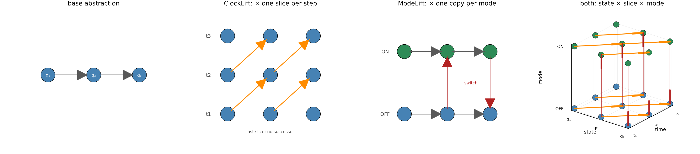{width="100%"}

```{=html}
<div style="display:flex; margin-top:-0.6em;">
  <div style="flex:1; text-align:center; font-size:0.7em;">\((x)\)</div>
  <div style="flex:1; text-align:center; font-size:0.7em;">\((x,t)\)</div>
  <div style="flex:1; text-align:center; font-size:0.7em;">\((x,k)\)</div>
  <div style="flex:1; text-align:center; font-size:0.7em;">\((x,k,t)\)</div>
</div>
```
:::

::: {style="text-align: center; font-size: 0.78em;"}
A lift is a synchronized product with a finite factor: every base transition is
replicated once per slice (clock) or per copy (mode).

Lift only what the specification quantifies.
:::

## Lifts 1/4: $(T)$, the base abstraction

:::: {.columns .vcenter}
::: {.column width="50%"}
```{.julia style="font-size: 0.72em;"}
import MathematicalSystems as MS   ## no HybridSystems
const PR = Dionysos.Problem

## Ṫ = -α(T - Ta) + βq,  q = 1 if the heater is ON, else 0
## as a switched affine system, one field per value of q
α, Ta, β = 0.1, 20.0, 2.0
A, b_on, b_off = SMatrix{1,1}(-α), SVector(α*Ta + β), SVector(α*Ta)

## Plant: the input selects the vector field
dyn = (x, u) -> u[1] == 1 ? A*x + b_on : A*x + b_off
X = LazySets.Hyperrectangle(;              ## T ∈ [18, 24] °C
    low = [18.0], high = [24.0])
U = LazySets.Hyperrectangle(;              ## 1 = ON, 2 = OFF
    low = [1], high = [2])
system = MS.ConstrainedBlackBoxControlContinuousSystem(
    dyn, 1, 1, X, U)

## Specification: reach the band, no timing
band = LazySets.Hyperrectangle(;
    low = [21.0], high = [23.0])
problem = PR.OptimalControlProblem(
    system, initial, band, nothing, nothing, PR.Infinity())
```

:::
::: {.column width="50%"}
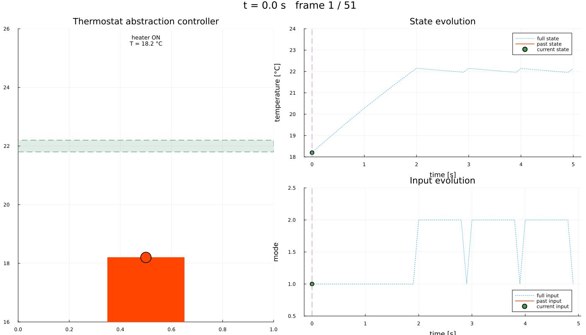{height=330}

::: {style="font-size: 0.70em; text-align: center;"}
**159 states · 626 transitions**
:::

::: {style="font-size: 0.62em;"}
**Reach and stay**: from 18 °C, reach the band 21.8-22.2 °C and hold it
forever. With no lift the model has infinite runs, so invariance is
expressible; the controller keeps cycling ON/OFF inside the band. No deadline,
no modes: the plain grid abstraction on $T$.
:::
:::
::::

## Lifts 2/4: $(T,t)$, the clock lift

:::: {.columns .vcenter}
::: {.column width="50%"}
```{.julia style="font-size: 0.63em;"}
const SY, PR = Dionysos.Symbolic, Dionysos.Problem

## The plant is UNCHANGED: same 1-D system as before
## Ṫ = -α(T - Ta) + βq,  α, Ta, β = 0.1, 20.0, 2.0
##   OFF: drifts to the ambient Ta = 20 °C
##   ON:  equilibrium at 40 °C, so it heats
system = ThermostatSystem.system()

## Timed task, stated over (T, t)
min_time, max_time = 3.0, 4.0         ## window [s]
initial = LazySets.Hyperrectangle(;
    low = [18.0, 0.0], high = [18.5, 0.0])
target = LazySets.Hyperrectangle(;
    low  = [21.0, min_time],          ## T ≥ 21, t ≥ 3
    high = [23.0, max_time])          ## T ≤ 23, t ≤ 4
problem = PR.OptimalControlProblem(
    system, initial, target,
    nothing, nothing, PR.Infinity())

## The LIFT: the clock is a factor of the abstraction,
## not a state dimension. One slice per step, exact.
MOI.set(optimizer, MOI.RawOptimizerAttribute("clock"),
    SY.ClockAbstraction(
        LazySets.Hyperrectangle(;
            low = [0.0], high = [5.0]),   ## t domain
        Δt))
```

:::
::: {.column width="50%"}
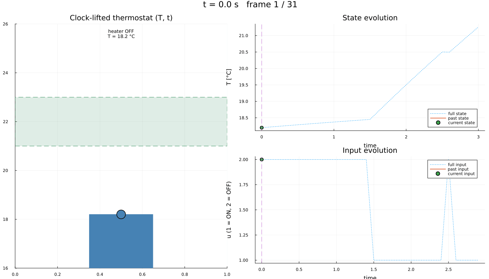{height=330}

::: {style="font-size: 0.70em; text-align: center;"}
**6 069 states = 119 spatial × 51 clock slices**
:::

::: {style="font-size: 0.62em;"}
The target is the **box** band $\times\,[3,4]$ s in $(T,t)$: the task is done
at the first instant where *both* coordinates are inside. Being in the band
earlier is allowed but does not count, and once the clock passes 4 s the
window is gone. Here the controller waits with the heater OFF (the room drifts
to the ambient 20 °C, below the band), then heats and enters at $t = 3.0$ s.
Necessarily a **reach**: a clock-lifted model has no infinite run, so it
expresses timed reachability, never "stay forever".
:::
:::
::::

## Lifts 3/4: $(T,k)$, the mode lift

:::: {.columns .vcenter}
::: {.column width="50%"}
```{.julia style="font-size: 0.55em;"}
import MathematicalSystems as MS
import HybridSystems as HS         ## now hybrid
const ST, PR = Dionysos.System, Dionysos.Problem

## Stronger heater here: α, Ta, β = 0.2, 18.0, 5.0
## One vector field per mode
off_dyn = (x, u) -> SVector(-α*(x[1] - Ta))
on_dyn  = (x, u) -> SVector(-α*(x[1] - Ta) + β*u[1])

## ... with its own input set
off = MS.ConstrainedBlackBoxControlContinuousSystem(
    off_dyn, 1, 1, X, U_off)   ## U_off = {0}
on = MS.ConstrainedBlackBoxControlContinuousSystem(
    on_dyn, 1, 1, X, U_on)     ## U_on = [0.2, 1]

## Switching structure
automaton = HS.GraphAutomaton(2)
HS.add_transition!(automaton, 1, 2, 1)   ## OFF → ON
HS.add_transition!(automaton, 2, 1, 2)   ## ON → OFF

## Each transition: a guard (where it may fire)
## and a reset (the jump map)
guard = X                    ## may switch anywhere
jump = x -> x                ## T is unchanged by a switch
reset_maps = [ST.GuardedResetMap(guard, jump),
              ST.GuardedResetMap(guard, jump)]
switchings = [HS.AutonomousSwitching(),
              HS.AutonomousSwitching()]
system = HS.HybridSystem(
    automaton, [off, on], reset_maps, switchings)

## Problem: augmented initial state, mode-indexed
## target, no clock anywhere
initial = (SVector(18.0), 1)             ## 18 °C, OFF
target_set = PR.HybridSpec(Dict(
    1 => PR.StateSpec(band),    ## OFF
    2 => PR.StateSpec(band)))   ## ON
problem = PR.OptimalControlProblem(
    system, initial, target_set,
    nothing, cost)   ## cost: energy + switch penalty
```

:::
::: {.column width="50%"}
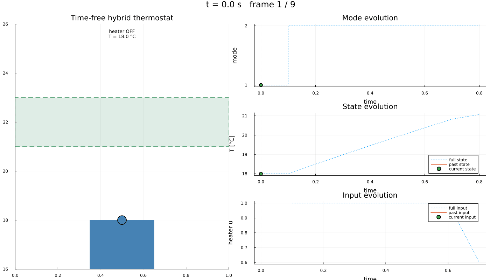{height=330}

::: {style="font-size: 0.70em; text-align: center;"}
**318 states · 3 396 transitions** · reached in 8 steps
:::

::: {style="font-size: 0.62em;"}
Start at 18 °C with the heater **OFF**, which here is exactly the ambient
temperature: that mode holds the room where it is, forever. Reaching the band
therefore *requires* switching **ON**, so the switch is a genuine decision.
Each mode carries its own input set, the transitions carry guards and resets,
and no time axis is paid for: two copies of the base abstraction, one per mode.
:::
:::
::::

## Lifts 4/4: $(T,k,t)$, both lifts

:::: {.columns .vcenter}
::: {.column width="50%"}
```{.julia style="font-size: 0.55em;"}
import MathematicalSystems as MS
import HybridSystems as HS
const ST, PR = Dionysos.System, Dionysos.Problem

## Same two physical modes as (T,k)
off = MS.ConstrainedBlackBoxControlContinuousSystem(
    off_dyn, 1, 1, X, U_off)      ## X = [17, 25] °C
on = MS.ConstrainedBlackBoxControlContinuousSystem(
    on_dyn, 1, 1, X, U_on)

## ... each paired with a clock SUBSYSTEM: this is
## what the builder detects to apply the ClockLift
clock = MS.ConstrainedLinearContinuousSystem(
    SMatrix{1,1}(1.0),            ## ṫ = 1
    T_domain)                     ## t ∈ [0, 50] s
modes = [ST.VectorContinuousSystem([off, clock]),
         ST.VectorContinuousSystem([on, clock])]

## The guard now lives in (T, t): switching is
## allowed anywhere, at any time
switch_domain = LazySets.Hyperrectangle(;
    low = [17.0, 0.0], high = [25.0, 100.0])
reset_maps = [ST.GuardedResetMap(switch_domain, x -> x),
              ST.GuardedResetMap(switch_domain, x -> x)]
system = HS.HybridSystem(
    automaton, modes, reset_maps, switchings)

## The augmented state is a TRIPLE (T, t, mode)
initial = (SVector(18.0), 0.0, 1)   ## 18 °C, t=0, OFF
window = LazySets.Hyperrectangle(;
    low = [15.0], high = [50.0])
target_set = PR.hybrid_reach_spec(
    [band, band],        ## per mode
    [window, window],    ## per mode
    [1, 2])
problem = PR.OptimalControlProblem(
    system, initial, target_set, nothing, cost)
```

:::
::: {.column width="50%"}
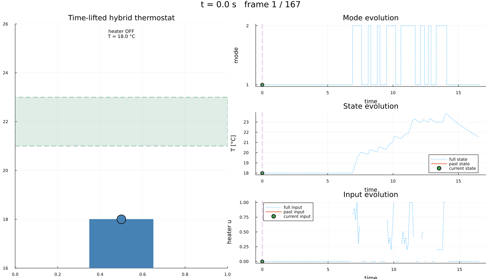{height=330}

::: {style="font-size: 0.70em; text-align: center;"}
**159 318 states = 159 × 501 clock slices × 2 modes**<br/>**1 698 318 transitions**
:::

::: {style="font-size: 0.62em;"}
Both lifts at once: the augmented state is the triple $(T, t, k)$, the same
`ClockLift` as $(T,t)$ applied per mode. Reach the band with the clock in
$[15, 50]$ s from 18 °C. **Before the window opens nothing constrains $T$**:
the run waits OFF until $t \approx 7$, heats, overshoots past 23 °C, then
settles into the band as the window opens and stops there. Asking for a clean
approach would mean adding a safety constraint, not a timing one.
:::
:::
::::

## Lifts: what the axes cost

::: {.vbody}
| abstraction | states | transitions | expresses |
| :-- | --: | --: | :-- |
| $(T)$ | 159 | 626 | reach, safety, reach-and-stay on $T$ |
| $(T,t)$ | 6 069 | 23 300 | timed reach, but no invariance |
| $(T,k)$ | 318 | 3 396 | + guards, resets, per-mode dynamics |
| $(T,k,t)$ | 159 318 | 1 698 318 | modes and timing together |

- Each lift multiplies the state count by its own factor: the mode axis by
  $\times 2$, the clock axis by one slice per step over the time domain
  ($\times 51$ for $[0,5]$ s, $\times 501$ for $[0,50]$ s). Lift only what the
  specification quantifies, and keep the clock domain tight.
- One mechanism throughout: the same `ClockLift` serves the continuous solver
  and each hybrid mode; specifications lift with the model.
:::

# JuMP front-end {.section-slide}

## Declare the model, the roles are inferred

:::: {.columns .vcenter}
::: {.column width="52%"}
```{.julia style="font-size: 0.62em;"}
model = Model(Dionysos.Optimizer)

## a variable under ∂ is a STATE, one that only
## appears on a right-hand side is an INPUT
@variable(model, x_low[i] ≤ x[i = 1:3] ≤ x_upp[i],
    start = [0.4, 0.4, 0.0][i])
@variable(model, -1 ≤ u[1:2] ≤ 1)

## unicycle, written as it is on paper
@constraint(model, ∂(x[1]) == u[1]*cos(α + x[3])*sec(α))
@constraint(model, ∂(x[2]) == u[1]*sin(α + x[3])*sec(α))
@constraint(model, ∂(x[3]) == u[1]*tan(u[2]))

## reach a box ...
@constraint(model, final(x[1]) in MOI.Interval(3.0, 3.6))
@constraint(model, final(x[2]) in MOI.Interval(0.3, 0.8))

## ... while avoiding the walls
for (lo, hi) in walls
    @constraint(model, x[1:2] ∉ MOI.HyperRectangle(lo, hi))
end
optimize!(model)
```
:::
::: {.column width="48%"}
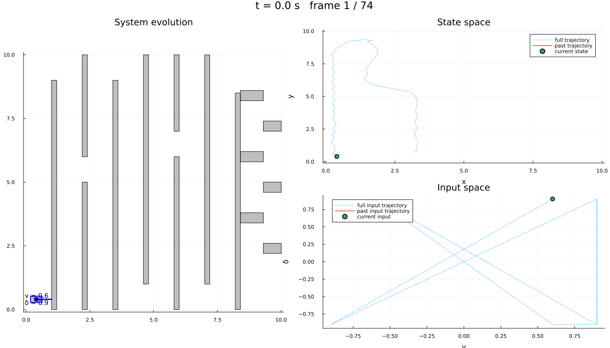{height=330}

::: {style="font-size: 0.62em;"}
No boilerplate: the model *is* the system and the specification. Roles come
from four rules (`∂` on the left ⇒ state, right-hand side only ⇒ input, a
variable used nowhere is an error). Here `∉` **carves the walls out of the
state space**, so those cells are never built; `Always` would keep them and
ask the controller to avoid them. The world versus the requirement.
:::
:::
::::

## One plant, two questions: safety and reach-and-stay

::: {style="font-size: 0.56em;"}
Adaptive cruise control (Ames et al., TAC 2017). State: the gap $z$ to a lead
car and the ego speed $v$; input: the acceleration $a$.
$$\dot z = v_0 - v, \qquad \dot v = a - \tfrac{1}{m}(f_0 + f_1 v + f_2 v^2),
\qquad v_0 = 13.9\ \text{m/s},\ \ |a| \le 2.9\ \text{m/s}^2$$
:::

:::: {.columns}
::: {.column width="53%"}
::: {style="font-size: 0.52em;"}
- **The constraint.** Stay $\tau_h = 1.8$ s of travel behind the lead,
  $z \ge \tau_h v$: 18 m at 10 m/s, 43 m at 24 m/s. A half-space, not a box.
- **Question 1, safety.** Can it be kept *forever*? The answer is a set, not a
  trajectory: the states from which some control succeeds. Strictly inside
  `safe`, since fast and at the limit even full braking loses it.
- **Question 2, the real task.** The set-point $v_\star = 24$ m/s is faster
  than the lead, so holding it forever is impossible: a **disjunction**, hold
  $v \approx v_\star$ **or** follow at $v \approx v_0$ within 45 m.
:::

```{.julia style="font-size: 0.47em; line-height: 1.05; margin-top: 4.8em;"}
@variable(model, z_low ≤ z ≤ z_upp)
@variable(model, v_low ≤ v ≤ v_upp)
@variable(model, -a_max ≤ a ≤ a_max)
@constraint(model, ∂(z) == v_lead - v)
@constraint(model, ∂(v) == a - (f0 + f1*v + f2*v^2)/m)

## the envelope, plus z ≥ τ_h·v: a half-space, so the
## safe set is a polytope and not a box
safe = LazySets.HPolytope([
    LazySets.HalfSpace(SVector(-1.0, τ_h), 0.0),   ## z ≥ τ_h·v
    LazySets.HalfSpace(SVector(1.0, 0.0), z_upp),  ## envelope
    LazySets.HalfSpace(SVector(-1.0, 0.0), -z_low),
    LazySets.HalfSpace(SVector(0.0, 1.0), v_upp),
    LazySets.HalfSpace(SVector(0.0, -1.0), -v_low)])

@constraint(model, [z, v] in Always(safe))       ## ⇒ SafetyProblem

## the disjunction: cruise band ∪ following band
target = UT.set_union([band(v_desired),
                       band(v_lead; gap_high = 45.0)])
@constraint(acc, [za, va] in
    EventuallyAlways(target; stay_on_first_entry = true))
@constraint(acc, [za, va] in Always(safe))       ## ⇒ ReachAndStay
```
:::
::: {.column width="47%"}
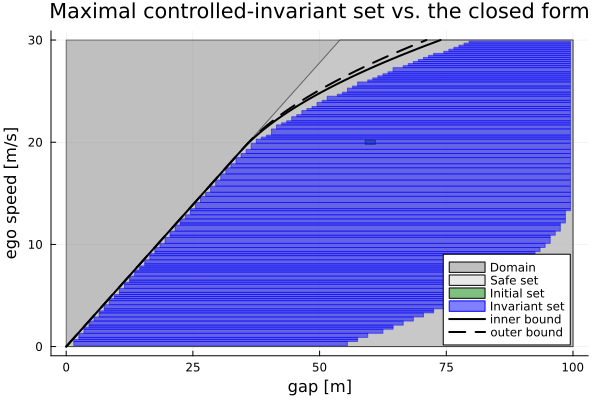{fig-align="center" height=150}

::: {style="font-size: 0.5em; text-align: center; margin-top: -0.6em;"}
Grey `safe`, blue the invariant subset computed, dashed the analytic bounds.
:::

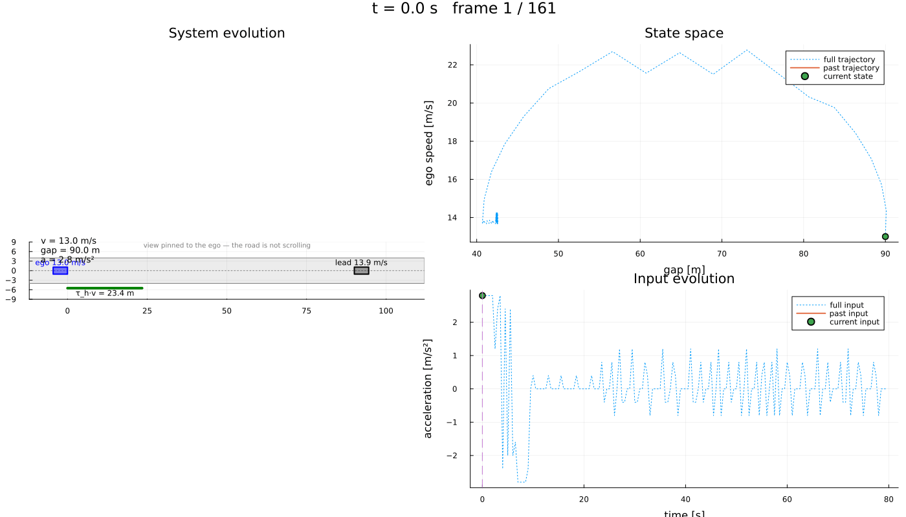{height=300}
:::
::::

## Co-safe LTL over named regions

:::: {.columns .vcenter}
::: {.column width="52%"}
```{.julia style="font-size: 0.58em; line-height: 1.12;"}
using Spot                    ## the ltl"..." macro

## regions are arbitrary LazySets: g1 is two disjoint
## boxes, g2 a box with a hole, obs a union of two
@constraint(model, g1, x in Label(UT.set_union([g11, g12])))
@constraint(model, g2, x in Label(UT.set_minus(big, hole)))
@constraint(model, g3, x in Label(g3_box))
@constraint(model, obs, x in Label(obs; semantics = MP.OUTER))

## visit g1, then g2, then g3, then g1 AGAIN
@specification(model,
    ltl"G(!obs) & F(g1 & F(g2 & F(g3 & F(g1))))")
```

::: {style="font-size: 0.58em;"}
The atomic proposition is the constraint's own name. Revisiting `g1` needs
**memory**: the controller carries the monitor state.
:::
:::
::: {.column width="48%"}
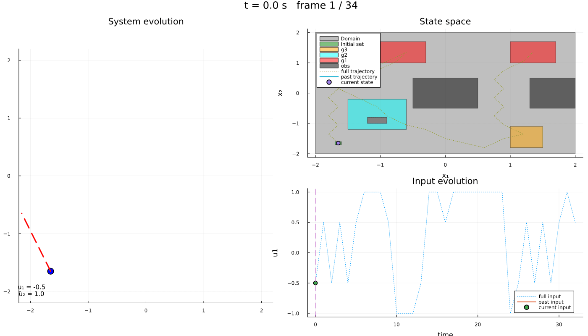{height=275}
:::
::::

:::: {.columns .vcenter style="margin-top: -0.6em;"}
::: {.column width="52%"}
```{.julia style="font-size: 0.58em; line-height: 1.12;"}
## same plant, a richer formula: an UNTIL
@constraint(model, danger,
    x in Label(UT.set_union([danger1, danger2])))

## reach g1, then stay clear of danger UNTIL g2
@specification(model,
    ltl"G(!obs) & F(g1 & ((!danger) U g2))")
```

::: {style="font-size: 0.58em;"}
`U` constrains the whole stretch between two events: the detour is required
only *after* `g1` and *until* `g2`, which no reach-avoid sequence expresses.
:::
:::
::: {.column width="48%"}
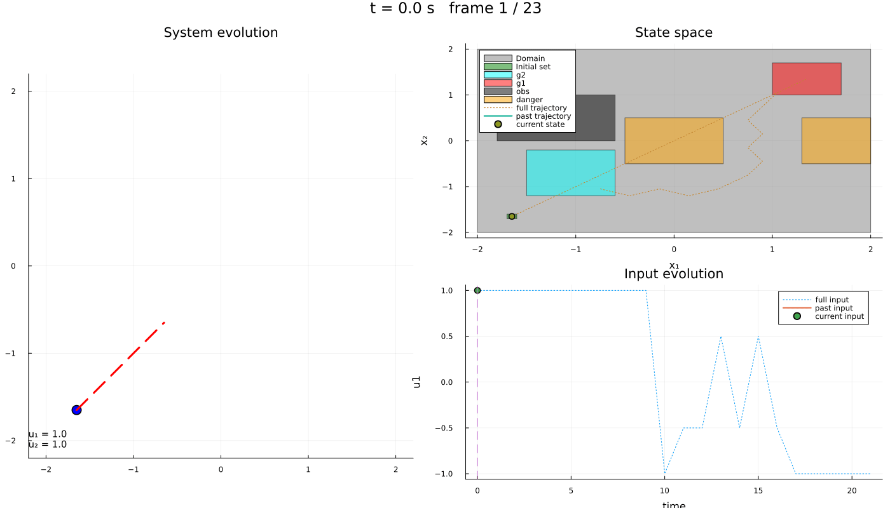{height=275}
:::
::::

## Hybrid models: modes and transitions

:::: {.columns .vcenter}
::: {.column width="50%"}
```{.julia style="font-size: 0.50em; line-height: 1.08;"}
## a mode is a scope you write constraints on
@mode(model, off); @mode(model, on)
@constraint(off, ∂(T) == -α*(T - Ta))
@constraint(on,  ∂(T) == -α*(T - Ta) + β*u)
@constraint(off, u == 0.0)        ## per-mode input set
@constraint(on, 0.2 ≤ u ≤ 1.0)

## a transition is a scope too: a constraint with ∂/Δ
## is the reset map, anything else is the guard
add_transition!(model, off => on) do t
    @constraint(t, T ≤ 19.0)
end
add_transition!(model, on => off) do t
    @constraint(t, T ≥ 21.0)      ## guard
    @constraint(t, Δ(T) == T)     ## reset map: identity
end                               ## here, so omittable

## a specification written on a mode holds in it only
@constraint(off, [T] in Final(comfortable))
@constraint(on,  [T] in Final(comfortable))
```
:::
::: {.column width="50%"}
{height=250}
:::
::::

:::: {.columns .vcenter}
::: {.column width="50%"}
```{.julia style="font-size: 0.50em; line-height: 1.08;"}
## a clock is just a variable with ∂(t) == 1, no new
## syntax; a time window is a reach constraint on it
@variable(model, 0 ≤ t ≤ 50)
@mode(model, task1); @mode(model, task2)
@constraint(task1, ∂(x) == A1*x + B1*u)
@constraint(task1, ∂(t) == 1)          ## the clock runs
add_transition!(model, task1 => task2) do tr
    @constraint(tr, x in guard1)              ## the guard
    @constraint(tr, Δ(x[1]) == x0_task2[1])   ## the piece enters
    @constraint(tr, Δ(x[2]) == x0_task2[2])   ## task 2 at a fixed
    @constraint(tr, Δ(t) == max(t_min, t))    ## pose, and the clock
end                                           ## is pushed forward to
                                              ## the window, never
                                              ## rewound
```

::: {style="font-size: 0.58em;"}
A variable whose dynamics are exactly `∂(t) == 1` is inferred as a **clock**;
the guards and targets then live in $(x, t)$.
:::
:::
::: {.column width="50%"}
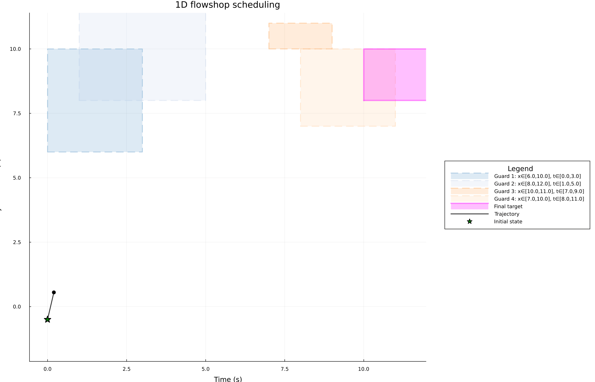{height=250}
:::
::::

## Disturbances: who owns the signal

::: {style="font-size: 0.56em;"}
A double integrator: position $x_1$, velocity $x_2$, bounded acceleration $u$,
and a disturbance the environment picks at every step. Reach the box at the
origin from $x_1 \approx -1.5$.
$$\dot x_1 = x_2 + w_1, \quad \dot x_2 = u + w_2, \quad
|w_1| \le 0.02,\ |w_2| \le 0.3, \quad x \in [-2,2]^2,\ |u| \le 1$$
:::

:::: {.columns .vcenter}
::: {.column width="52%"}
::: {style="font-size: 0.66em;"}
**JuMP front-end:** the role is declared, nothing else changes.
:::

```{.julia style="font-size: 0.52em; line-height: 1.08;"}
initial = LazySets.Hyperrectangle(; low = [-1.6, -0.1], high = [-1.4, 0.1])
target = LazySets.Hyperrectangle(; low = [-0.4, -0.4], high = [0.4, 0.4])

@variable(model, -2 ≤ x[1:2] ≤ 2)
@variable(model, -1 ≤ u ≤ 1)          ## INPUT, inferred
w̄ = [0.02, 0.3]
@variable(model, -w̄[i] ≤ w[i=1:2] ≤ w̄[i])
set_role!(w, Dionysos.DISTURBANCE)    ## DISTURBANCE, declared
@constraint(model, ∂(x[1]) == x[2] + w[1])
@constraint(model, ∂(x[2]) == u + w[2])
@constraint(model, x in Start(initial))
@constraint(model, x in Final(target))
optimize!(model)
```

::: {style="font-size: 0.66em;"}
**Direct MOI:** the ownership is in the system type.
:::

```{.julia style="font-size: 0.52em; line-height: 1.08;"}
sys = MS.NoisyConstrainedBlackBoxControlContinuousSystem(
    (x, u, w) -> SVector(x[2] + w[1], u[1] + w[2]),
    2, 1, 2, X, U, W)          ## W: the disturbance set
problem = PR.OptimalControlProblem(
    sys, initial, target, nothing, nothing, PR.Infinity())
MOI.optimize!(optimizer)
```
:::
::: {.column width="48%"}
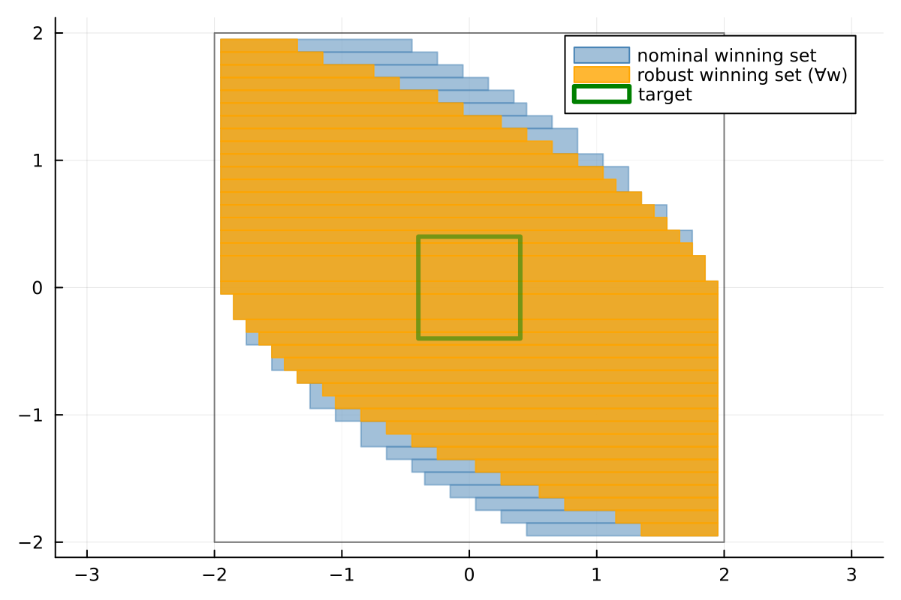{height=285}

::: {style="font-size: 0.56em;"}
Declaring the role changes the question, not a label: the model lowers to a
noisy system, the abstraction folds $W$ into its reachable sets, and the
controller is valid for **every** signal in $W$. Same build cost, `w` is never
enumerated. The robust winning set (orange, 1015 cells) sits strictly inside
the nominal one (blue, 1135): the states given up are those where the
disturbance outruns the remaining braking authority.
:::
:::
::::

## Which problem, which solver

:::: {.columns .vtop}
::: {.column width="56%"}
::: {style="font-size: 0.78em;"}
| Specification | `ProblemType` | Algorithm | Controller |
| :-- | :-- | :-- | :-- |
| reach-avoid | `OptimalControlProblem` | worst-case cost fixed point | static |
| safety | `SafetyProblem` | maximal controlled invariant set | static |
| reach and stay | `ReachAndStayProblem` | invariant set, then reach it | static |
| co-safe LTL | `CoSafeLTLProblem` | product with the monitor, then reachability | dynamic, memory = monitor state |
| slew-rate limit | `+ BoundedInputVariation` | Dijkstra on (state, input) pairs | dynamic, memory = previous input |
:::

::: {style="font-size: 0.74em; margin-top: 0.8em;"}
The front-end picks the solver from the constraints you wrote. **Every
reachability task can also be written in co-safe LTL. It should not be:** write
the specification that matches the question, and keep LTL for what genuinely
needs memory, sequencing, until, revisits.
:::
:::
::: {.column width="44%"}
::: {style="font-size: 0.62em;"}
The same task, written the two ways. Same 2-D integrator, same grid, **same
abstraction** (2 401 states, 259 081 transitions), same answer (2 401
controllable states).
:::

```{.julia style="font-size: 0.56em; line-height: 1.15;"}
## the specification that matches the question
@constraint(model, x in Final(goal))
```

```{.julia style="font-size: 0.56em; line-height: 1.15;"}
## the same thing, stated as co-safe LTL
@constraint(model, g, x in Label(goal))
@specification(model, ltl"F(g)")
```

```{=html}
<svg viewBox="0 0 320 108" style="width:62%; height:auto; display:block; margin:0.2em auto 0;" xmlns="http://www.w3.org/2000/svg">
  <defs>
    <marker id="monarrow" viewBox="0 0 10 10" refX="9" refY="5" markerWidth="5" markerHeight="5" orient="auto-start-reverse">
      <path d="M 0 0 L 10 5 L 0 10 z" fill="#00449e"/>
    </marker>
  </defs>
  <g fill="none" stroke="#00449e" stroke-width="2" marker-end="url(#monarrow)">
    <line x1="14" y1="66" x2="52" y2="66"/>
    <line x1="102" y1="66" x2="196" y2="66"/>
    <path d="M 62 46 C 48 8, 108 8, 94 46"/>
    <path d="M 202 46 C 188 8, 248 8, 234 46"/>
  </g>
  <g stroke="#00449e" stroke-width="1.6" fill="#ccf0ff">
    <circle cx="78" cy="66" r="22"/>
    <circle cx="218" cy="66" r="22"/>
  </g>
  <circle cx="218" cy="66" r="17" fill="none" stroke="#00449e" stroke-width="1.4"/>
  <g font-size="15" fill="#333" text-anchor="middle">
    <text x="78" y="71">q₁</text>
    <text x="218" y="71">q₂</text>
  </g>
  <g font-size="13" fill="#333" text-anchor="middle">
    <text x="78" y="8">¬g</text>
    <text x="218" y="8">true</text>
    <text x="149" y="58">g</text>
  </g>
  <text x="218" y="104" font-size="11" fill="#666" text-anchor="middle">accepting</text>
</svg>
```

::: {style="font-size: 0.56em; text-align: center; margin-top: -0.3em;"}
The monitor of `F(g)`: two states, so the product is two copies of the
abstraction.
:::

::: {style="font-size: 0.62em; margin-top: 0.3em;"}
| | graph searched | synthesis |
| :-- | --: | --: |
| `Final(goal)` | 2 401 | **0.91 s** |
| `ltl"F(g)"` | 4 786 (×2) | **22.6 s** (×25) |
:::

::: {style="font-size: 0.58em; margin-top: 0.4em;"}
`F(g)` is the mildest formula there is, a two-state monitor, so the product
merely doubles the graph: one copy per monitor state. The wall clock does worse
than the size, because the product has to be built and the controller tabulated
over pairs.
:::
:::
::::

# Robust control {.section-slide}

## Robust synthesis and verification: ∃u ∀w

::: {style="font-size: 0.72em;"}
A control task is a **game**: the controller picks $u$, the environment picks
$w$. One mechanism, three regimes, the solvers never learn which they are in.
:::

::: {style="font-size: 0.66em;"}
| | question | who owns the alphabet | answer |
| :-- | :-- | :-- | :-- |
| **synthesis** | $\exists u$ | the controller owns all of it | a controller |
| **robust synthesis** | $\exists u\, \forall w$ | shared | a controller valid for every $w$ |
| **verification** | $\forall w$ | the environment owns all of it | a verified set, or a counterexample |
:::

::: {style="font-size: 0.66em;"}
The two extremes are the degenerate cases of the middle one. `FoldedAutomaton`
hands part of the input alphabet to the environment, so
$\mathrm{Post}(q,u) = \bigcup_w \mathrm{Post}(q,u,w)$ and the **unchanged**
controlled predecessor computes the robust game. On the plant side, the
disturbance is folded into the growth bound (Reissig–Weber–Rungger, TAC 2017),
never enumerated: robust abstraction costs what the nominal one costs.
:::

::: {style="font-size: 0.62em; text-align: center;"}
Gol-Lazar-Belta benchmark, co-safe LTL:
`ltl"(!R2 U D) & F(R1) & ((R3 -> X(!R1)) U D)"`
:::

::: {style="font-size: 0.5em; text-align: center; margin-top: -0.7em;"}
avoid $R_2$ until the target $D$ is reached, visit $R_1$ at some point, and
never enter $R_1$ right after $R_3$, all of it until $D$
:::

:::: {.columns .vcenter}
::: {.column width="38%"}
{fig-align="center" height=215}

::: {style="font-size: 0.56em; text-align: center;"}
**synthesis** ($\exists$): 4 379 of 6 332 cells controllable
:::
:::
::: {.column width="24%"}
::: {style="font-size: 0.5em; text-align: center;"}
$$x^+ = A_{\sigma}\, x, \qquad \sigma \in \{1,2\}$$
$$A_1 = \begin{bmatrix} -0.65 & 0.32 \\ -0.42 & -0.92 \end{bmatrix}$$
$$A_2 = \begin{bmatrix} \phantom{-}0.65 & 0.32 \\ -0.42 & -0.92 \end{bmatrix}$$
:::
:::
::: {.column width="38%"}
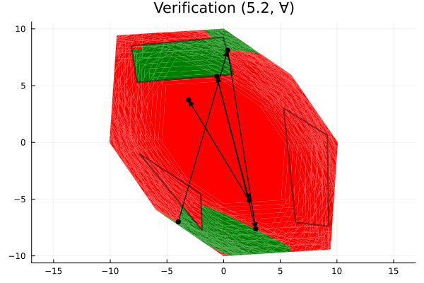{fig-align="center" height=215}

::: {style="font-size: 0.56em; text-align: center;"}
**verification** ($\forall$): 1 867 verified, a defeating word elsewhere
:::
:::
::::

# Certified trajectories {.section-slide}

## Pipeline

```{mermaid}
%%| fig-align: center
%%| fig-width: 9
flowchart LR
  A["<b>Plan</b><br/>coarse grid abstraction<br/><i>a feasible seed</i>"] --> B["<b>Refine</b><br/>MPPI on the seed<br/><i>an accurate trajectory</i>"] --> C["<b>Certify</b><br/>ellipsoidal funnels, SDP<br/><i>a tube around it</i>"]
  C -. retry .-> B
```

::: {style="font-size: 0.72em;"}
The grid gives feasibility on a coarse abstraction, MPPI buys back the accuracy
the grid lost, the SDP turns the single trajectory into a set. The dashed edge
is the solver: `TrajectoryCertificationOptimizer` re-runs the generator when a
funnel step is infeasible. Implements and extends Florentin Canart's master
thesis (PR #569).
:::

:::: {.columns .flexrow}
::: {.column width="26%"}
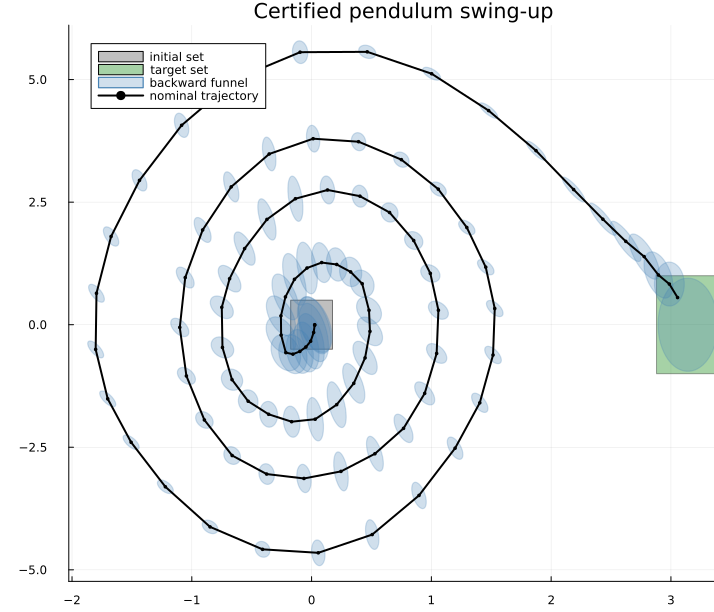{fig-align="center" width="98%"}
:::
::: {.column width="37%"}
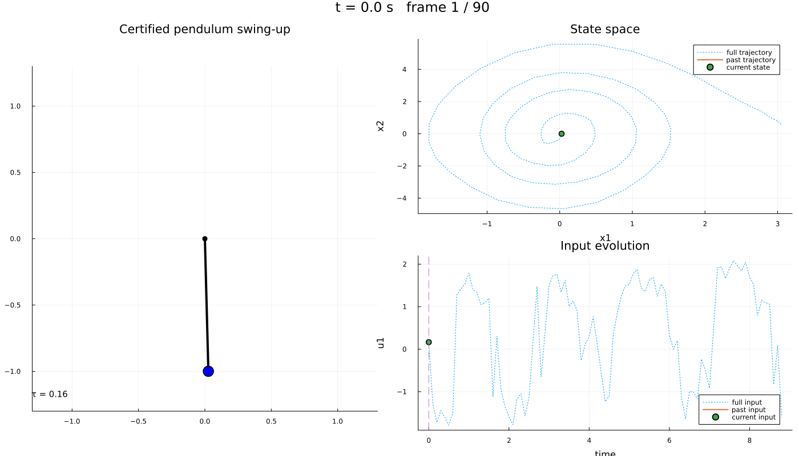{fig-align="center" width="98%"}
:::
::: {.column width="37%"}
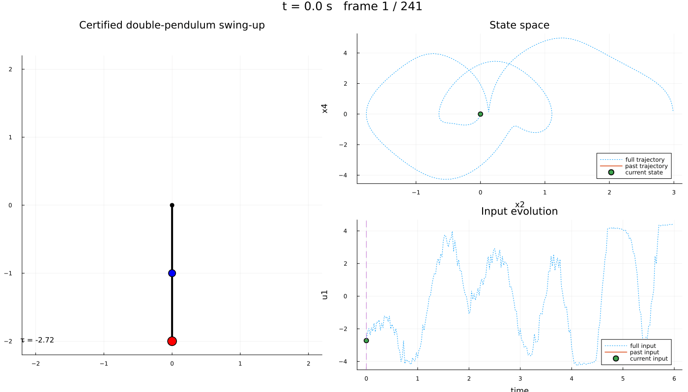{fig-align="center" width="98%"}
:::
::::

::: {style="font-size: 0.5em; text-align: center; margin-top: -0.8em;"}
The certified funnel chain, the closed loop it controls, and the same pipeline
on the double pendulum, 4-D with one torque.
:::

## Articulated vehicle results

:::: {.columns}
::: {.column width="50%"}
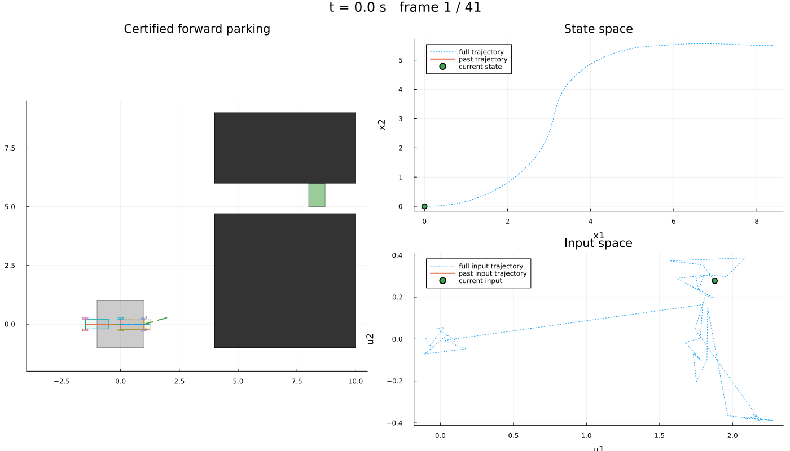{height=256 style="margin-bottom: -1.4em;"}

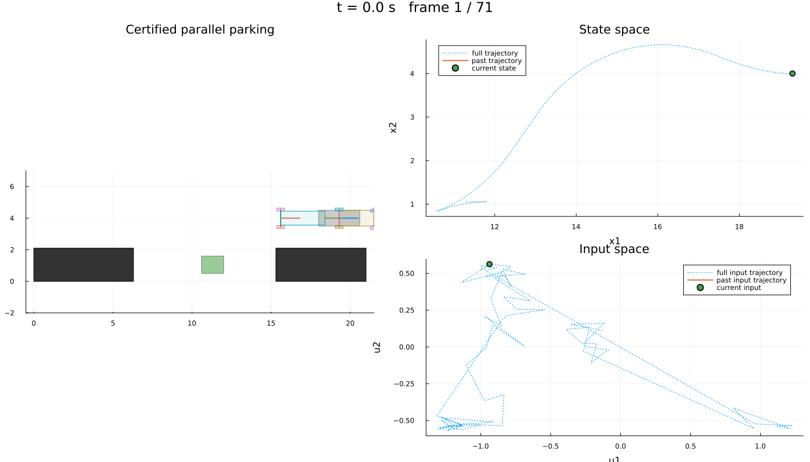{height=256 style="margin-bottom: -1.4em;"}
:::
::: {.column width="50%"}
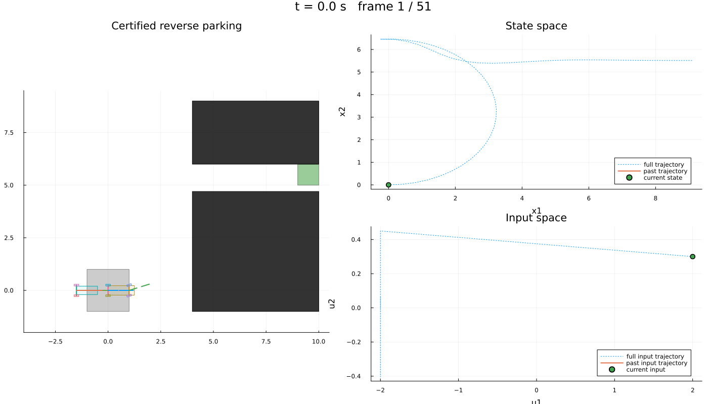{height=256 style="margin-bottom: -1.4em;"}

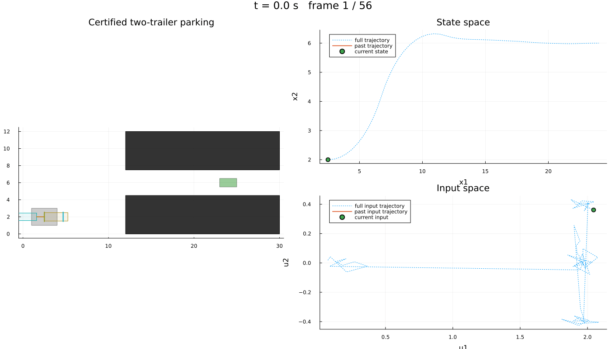{height=256 style="margin-bottom: -1.4em;"}
:::
::::

::: {style="font-size: 0.46em; text-align: center; margin-top: 3.0em;"}
$$\dot x_1 = v\cos\theta, \quad \dot x_2 = v\sin\theta, \quad
\dot\theta = \tfrac{v}{L_1}\tan\delta, \quad
\dot\varphi = -\tfrac{v}{L_1 L_2}\bigl(L_1\sin\varphi + (L_c\cos\varphi + L_2)\tan\delta\bigr)$$

Tractor and trailer, $x = (x_1, x_2, \theta, \varphi) \in \mathbb{R}^4$ with
hitch angle $\varphi$, inputs $u = (v, \delta)$. The two-trailer model carries a
second hitch angle, $x \in \mathbb{R}^5$.
:::

# Path-complete abstractions of switched systems {.section-slide}

::: {style="text-align: center; font-size: 0.7em; margin-top: 1em;"}
HSCC 2027, with A. Abate, V. Debauche, M. Giacobbe, R. M. Jungers, D. Roy
:::

## 1. Switched systems and the specification problem

:::: {.columns .vcenter}
::: {.column width="55%"}
- $x^+ = A_\sigma x$; the switching signal is the only external signal:
  a control input under **synthesis** (∃σ), a disturbance under
  **verification** (∀σ).

  ::: {style="font-size: 0.8em;"}
  $$A_1 = \begin{bmatrix} -0.65 & 0.32 \\ -0.42 & -0.92 \end{bmatrix}, \qquad
  A_2 = \begin{bmatrix} \phantom{-}0.65 & 0.32 \\ -0.42 & -0.92 \end{bmatrix}$$
  :::
- Co-safe LTL over regions; the Gol–Lazar–Belta instance:
  $\varphi = (\neg R_2 \mathbin{\mathsf U} D) \wedge \mathsf F R_1 \wedge
  ((R_3 \rightarrow \mathsf X \neg R_1) \mathbin{\mathsf U} D)$

  ::: {style="font-size: 0.82em;"}
  avoid $R_2$ until the target $D$ is reached, visit $R_1$ at some point, and
  never enter $R_1$ right after $R_3$, all of it until $D$
  :::
- The state space is infinite and the question is a temporal one: neither
  side is a graph problem yet.
:::
::: {.column width="45%"}
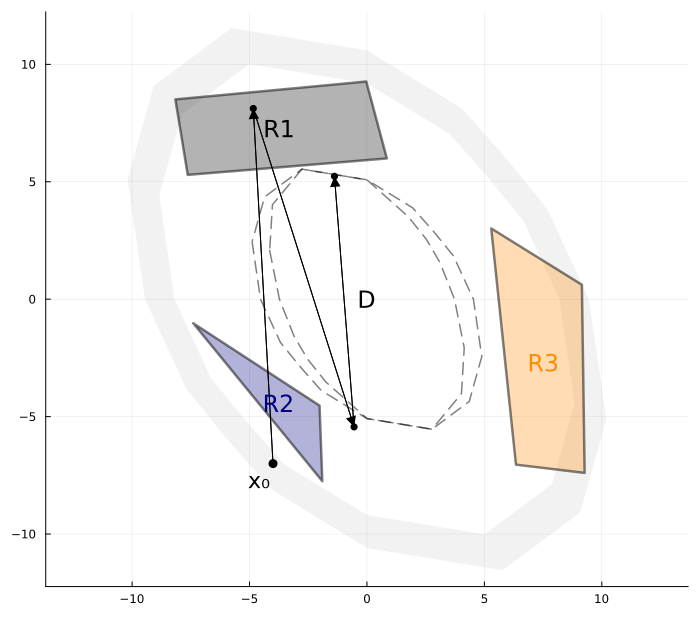{height=380}
:::
::::

## 2. Abstraction and bisimulation

::: {style="font-size: 0.78em;"}
A finite partition of $\mathcal{X}$ gives a **quotient** $\mathcal{Q}$, one
state per cell, **bisimilar** to $\mathcal{T}$ when states of a cell have the
**same observation** and **every transition of one side is matched by the
other**. Such a quotient preserves all LTL and CTL properties (Tabuada 2009),
so synthesis and verification become graph problems.
:::

```{=html}
<svg viewBox="0 0 408 172" style="width:72%; height:auto; display:block; margin:0.4em auto 0;" xmlns="http://www.w3.org/2000/svg">
  <defs>
    <marker id="bsarrow" viewBox="0 0 10 10" refX="9" refY="5" markerWidth="5" markerHeight="5" orient="auto-start-reverse">
      <path d="M 0 0 L 10 5 L 0 10 z" fill="#00449e"/>
    </marker>
  </defs>
  <g stroke="none">
    <rect x="16" y="16" width="60" height="128" fill="#ccf0ff"/>
    <rect x="76" y="16" width="64" height="56" fill="#b3ffb3"/>
    <rect x="76" y="72" width="64" height="72" fill="#dfdfdf"/>
    <rect x="140" y="16" width="52" height="128" fill="#ffa6a6"/>
  </g>
  <g stroke="#8c8c8c" stroke-width="1" fill="none">
    <rect x="16" y="16" width="176" height="128"/>
    <line x1="76" y1="16" x2="76" y2="144"/>
    <line x1="140" y1="16" x2="140" y2="144"/>
    <line x1="76" y1="72" x2="140" y2="72"/>
  </g>
  <g font-size="11" fill="#333" text-anchor="middle">
    <text x="46" y="134">c₁</text>
    <text x="108" y="34">c₂</text>
    <text x="108" y="134">c₃</text>
    <text x="166" y="134">c₄</text>
  </g>
  <polyline points="36,116 96,44 120,104 168,64" fill="none" stroke="#00449e" stroke-width="2.4" marker-end="url(#bsarrow)"/>
  <g fill="#00449e">
    <circle cx="36" cy="116" r="2.6"/><circle cx="96" cy="44" r="2.6"/>
    <circle cx="120" cy="104" r="2.6"/><circle cx="168" cy="64" r="2.6"/>
  </g>
  <line x1="208" y1="80" x2="240" y2="80" stroke="#00449e" stroke-width="3" marker-end="url(#bsarrow)"/>
  <text x="226" y="70" font-size="11" fill="#00449e" text-anchor="middle">quotient</text>
  <g stroke="#00449e" stroke-width="2" marker-end="url(#bsarrow)">
    <line x1="284" y1="94" x2="326" y2="64"/>
    <line x1="332" y1="65" x2="332" y2="102"/>
    <line x1="342" y1="109" x2="378" y2="80"/>
  </g>
  <g stroke="#00449e" stroke-width="1.2" font-size="10" fill="#333" text-anchor="middle">
    <circle cx="276" cy="104" r="13" fill="#ccf0ff"/>
    <circle cx="332" cy="52" r="13" fill="#b3ffb3"/>
    <circle cx="332" cy="116" r="13" fill="#dfdfdf"/>
    <circle cx="388" cy="72" r="13" fill="#ffa6a6"/>
  </g>
  <g font-size="10" fill="#333" text-anchor="middle">
    <text x="276" y="108">c₁</text>
    <text x="332" y="56">c₂</text>
    <text x="332" y="120">c₃</text>
    <text x="388" y="76">c₄</text>
  </g>
  <g font-size="10" fill="#888" text-anchor="middle">
    <text x="104" y="162">concrete trajectory</text>
    <text x="332" y="162">abstract path</text>
  </g>
</svg>
```

::: {style="text-align: center;"}
*A bisimulation turns a continuous problem into a graph problem.*
:::

## 3. The classical construction: one common Lyapunov function

::: {style="font-size: 0.78em;"}
Gol-Lazar-Belta (TAC 2014) use a **common** polyhedral $V$ with contraction
$\gamma$. Its nested sublevel sets $\mathcal{P}_\tau = \{x : V(x) \le \tau\}$
cut $\mathcal{X}$ into *slices*
$\mathcal{S}_i = \mathcal{P}_{\tau_i} \setminus \mathcal{P}_{\tau_{i-1}}$:
every transition falls at least one slice inward, so one outward sweep
terminates.
:::

:::: {.columns .vcenter}
::: {.column width="48%"}
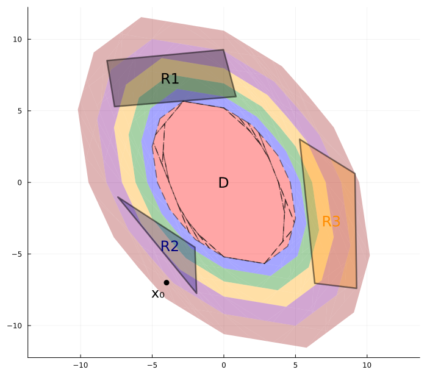{fig-align="center" height=410}

::: {style="font-size: 0.56em; text-align: center;"}
**Slices.** Every step moves at least one slice inward.
:::
:::
::: {.column width="52%"}
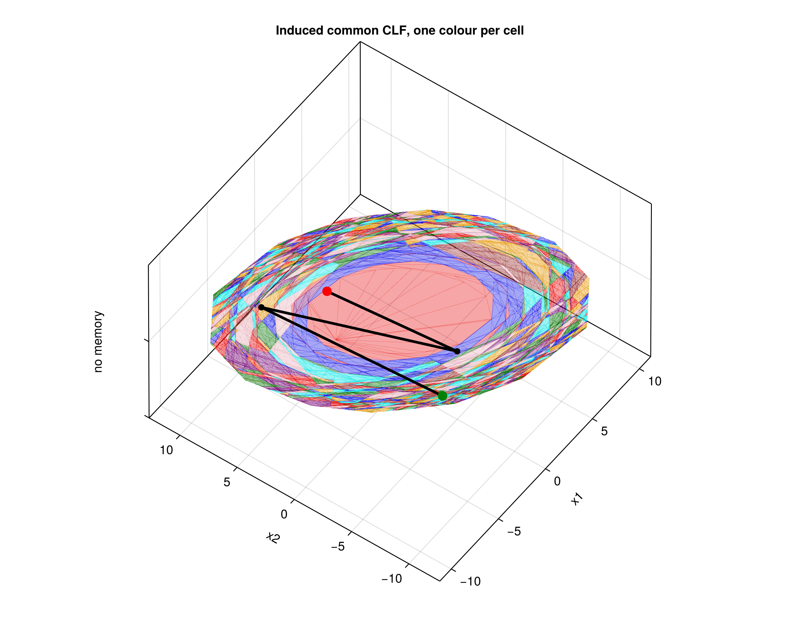{fig-align="center" height=410}

::: {style="font-size: 0.56em; text-align: center;"}
**The cuts.** One colour per cell of the induced CLF.
:::
:::
::::

::: {style="text-align: center; font-size: 0.8em;"}
*One function must carry all the switching information. It pays for it in
geometry.*
:::

## 4. Path-complete certificates and the augmented system

::: {style="font-size: 0.76em;"}
A **path-complete Lyapunov function** (Ahmadi et al., SIAM 2014) replaces $V$
by a family $\{V_s\}_{s \in S}$ on a labelled graph $\mathcal{G} = (S, E)$
accepting every word over $\langle M \rangle$:
$$\forall (s,m,d) \in E : \quad V_d(A_m x) \le \gamma\, V_s(x).$$
:::

```{=html}
<svg viewBox="0 0 560 176" style="width:52%; height:auto; display:block; margin:-0.2em auto 0;" xmlns="http://www.w3.org/2000/svg">
  <defs>
    <marker id="pcarrow" viewBox="0 0 10 10" refX="9" refY="5" markerWidth="5" markerHeight="5" orient="auto-start-reverse">
      <path d="M 0 0 L 10 5 L 0 10 z" fill="#00449e"/>
    </marker>
  </defs>
  <g fill="none" stroke="#00449e" stroke-width="2" marker-end="url(#pcarrow)">
    <path d="M 62 62 C 44 18, 116 18, 98 62"/>
    <path d="M 312 62 C 294 18, 366 18, 348 62"/>
    <path d="M 412 62 C 394 18, 466 18, 448 62"/>
    <path d="M 352 70 Q 390 42, 428 70"/>
    <path d="M 428 90 Q 390 118, 352 90"/>
  </g>
  <g font-size="13" fill="#333" text-anchor="middle">
    <text x="80" y="14">1, …, M</text>
    <text x="330" y="14">1</text>
    <text x="430" y="14">2</text>
    <text x="390" y="38">2</text>
    <text x="390" y="132">1</text>
  </g>
  <g stroke="#00449e" stroke-width="1.6" fill="#ccf0ff">
    <circle cx="80" cy="80" r="22"/>
    <circle cx="330" cy="80" r="22"/>
    <circle cx="430" cy="80" r="22"/>
  </g>
  <g font-size="15" fill="#333" text-anchor="middle">
    <text x="80" y="85">V</text>
    <text x="330" y="85">V₁</text>
    <text x="430" y="85">V₂</text>
  </g>
  <g font-size="12" fill="#666" text-anchor="middle">
    <text x="80" y="152">common LF</text>
    <text x="80" y="168">(no memory)</text>
    <text x="380" y="152">path-complete LF</text>
    <text x="380" y="168" fill="#e0561c">(finite memory)</text>
  </g>
</svg>
```

::: {style="font-size: 0.66em; border: 1.5px solid #e0561c; border-radius: 8px; padding: 0.3em 0.8em; margin: 0.4em auto; width: 76%; text-align: center;"}
$\mathcal{T}_{\mathrm{aug}}$ has state space $\mathcal{X} \times S$, and
$(x,s) \xrightarrow{m} (x',d) \iff x' = A_m x$ and $(s,m,d) \in E$, with
$h(x,s) = h(x)$.
:::

::: {style="font-size: 0.66em;"}
**Theorem.** $\mathcal{T} \cong_B \mathcal{T}_{\mathrm{aug}}$ always;
$\mathcal{T} \cong_S \mathcal{T}_{\mathrm{aug}}$ if $\mathcal{G}$ is complete.
Any quotient of $\mathcal{T}_{\mathrm{aug}}$ is then a correct abstraction of
$\mathcal{T}$.

**Two roles.** Path-completeness gives the equivalence, stability
($\gamma < 1$) makes the backward construction terminate.
:::

::: {style="text-align: center; font-size: 0.8em;"}
*The graph node is memory. It comes with the certificate.*
:::

## 5. The algorithm: a single outward sweep

::: {style="font-size: 0.7em;"}
Each node carries its own slices
$\mathcal{S}^{(s)}_i = \mathcal{P}^{(s)}_i \setminus \mathcal{P}^{(s)}_{i-1}$.
Contraction gives $A_m \mathcal{P}^{(s)}_i \subseteq \mathcal{P}^{(d)}_{i-1}$
on every edge, so transitions strictly decrease the slice index and one sweep
suffices.
:::

:::: {.columns .vcenter}
::: {.column width="52%"}
```{=html}
<div class="algobox">
  <div class="algotitle">Algorithm 1: Abstraction</div>
  <div class="algoio"><b>in:</b> PCLF \((\mathcal{G}, \{V_s\}, \gamma)\), working set \(\mathcal{X}\), regions \(\{R_i\}\)</div>
  <div class="l0"><b>1.</b> build the slices \(\mathcal{S}^{(s)}_i\) and the terminal sets</div>
  <div class="l0"><b>2.</b> \(P_0 \leftarrow\) observation regions \(\cap\) slices</div>
  <div class="l0"><b>3.</b> \(\mathcal{Q}_0 \leftarrow\) one state per cell of \(P_0\)</div>
  <div class="l0"><b>4. for</b> \(i = 0, \dots, N-1\)</div>
  <div class="l1"><b>for</b> \((s,m,d) \in E\)</div>
  <div class="l2"><b>for</b> \(q\) with \(\mathrm{conc}(q) \subseteq \mathcal{S}^{(d)}_i \times \{d\}\)</div>
  <div class="l3">\((P,\mathcal{Q}) \leftarrow\) <span class="algocall">Refine</span>\((P,\mathcal{Q},(s,m,d),q)\)</div>
  <div class="algoio"><b>out:</b> \(\mathcal{Q}_N\), a bisimulation quotient of \(\mathcal{T}_{\mathrm{aug}}\)</div>
</div>

<div class="algobox">
  <div class="algotitle">Algorithm 2: Refine\((P,\mathcal{Q},(s,m,d),q)\)</div>
  <div class="l0"><b>1.</b> \(\widetilde P \leftarrow \mathrm{Pre}^{\mathcal{G}}_{(s,m,d)}(q)\)</div>
  <div class="l0"><b>2. for</b> each cell \(q'\) at node \(s\) meeting \(\widetilde P\)</div>
  <div class="l1">\(q'_1 \leftarrow q' \cap \widetilde P\), \(\;q'_2 \leftarrow q' \setminus \widetilde P\)</div>
  <div class="l1">keep the nonempty parts, copy their transitions</div>
  <div class="l1">add the transition \(q'_1 \xrightarrow{m} q\)</div>
</div>
```
:::
::: {.column width="48%"}
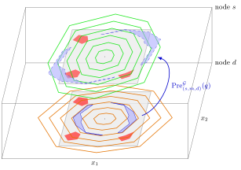{fig-align="center" width="94%"}

::: {style="font-size: 0.56em; text-align: center;"}
The pre-image of a target cell $q$ at node $d$ is computed at node $s$.
:::
:::
::::

::: {style="font-size: 0.6em; margin-top: -0.2em;"}
**Theorem.** Algorithm 1 terminates and returns a finite bisimulation quotient
of $\mathcal{T}_{\mathrm{aug}}$. For $|S| = 1$ it collapses to Gol-Lazar-Belta
2014.
:::

::: {style="text-align: center; font-size: 0.74em;"}
*Transitions only go inward, so one outward sweep is enough.*
:::

## 6. A cover, not a partition: ∃ and ∀ from one quotient

- The quotient partitions $\mathcal{X} \times S$; projected to $\mathcal{X}$
  it is a **cover**: synthesis reads it existentially (∃s), verification
  universally (∀s).
- 4 379 / 6 332 cells controllable; 1 867 verified; at the paper's initial
  point the defeating word $1\,2\,2\,1\,(1)^\omega$ is extracted and replayed.

:::: {.columns}
::: {.column width="33%"}
{height=280}
:::
::: {.column width="33%"}
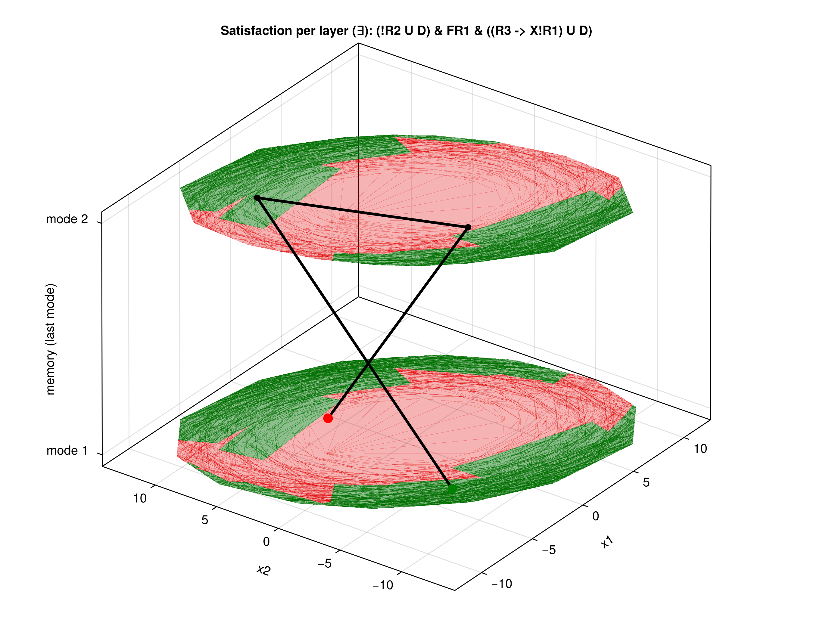{height=280}
:::
::: {.column width="33%"}
{height=280}
:::
::::

::: {style="text-align: center;"}
Synthesis (∃) · satisfaction per memory layer · verification (∀).
:::

## 7. Numerical results

:::: {.columns .vcenter}
::: {.column width="46%"}
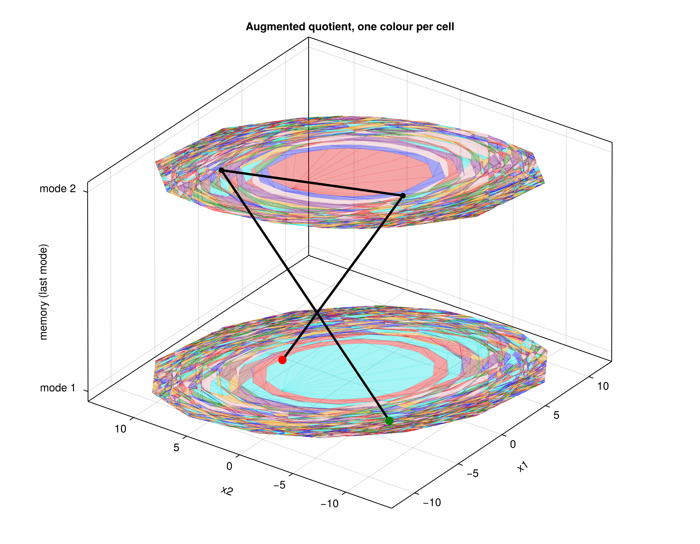{fig-align="center" height=430}

::: {style="font-size: 0.56em; text-align: center;"}
**The quotient we build.** One layer per memory state; the trajectory changes
layer with the switching history.
:::
:::
::: {.column width="54%"}
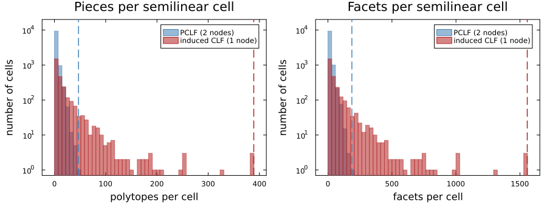{fig-align="center" height=430}

::: {style="font-size: 0.56em; text-align: center;"}
**What one cell costs.** PCLF (blue) stays near the origin; the induced CLF
(red) has a tail out to about 1 500 facets.
:::
:::
::::

::: {style="text-align: center; font-size: 0.8em;"}
*Same certificate, same behaviours, far simpler cells.*
:::

# Velocity-controlled biped {.section-slide}

::: {style="text-align: center; font-size: 0.7em; margin-top: 1em;"}
with Riccardo Bertollo's robot, PR #603
:::

## Why control the robot at the velocity level

::: {.vbody}
:::: {.columns .vcenter}
::: {.column width="54%"}
::: {style="font-size: 0.78em;"}
- The torque-controlled models of this robot are 6-D or 8-D. Certifying the
  multibody dynamics at that size is out of reach for a grid.
- **Change the level of abstraction.** Delegate the torque loop to the motors'
  own velocity controllers and certify the kinematic layer above them. The
  state becomes the four joint angles, the input the commanded joint
  velocities:
  $$\dot x = u, \qquad x = (\theta_1, \theta_2, \theta_3, \theta_4).$$
- The dimension halves and $f(x,u) = x + \tau u$ is **exact**: no growth
  bound, no over-approximation of the flow.
- **What is assumed:**
    1. the low-level loop tracks the commanded velocity within one period;
    2. the motion is quasi-static and the stance foot stays pinned.

  A bounded tracking error re-enters as a disturbance: the abstraction then
  stops being a bisimulation and becomes an alternating simulation, still
  sound.
:::
:::
::: {.column width="46%"}
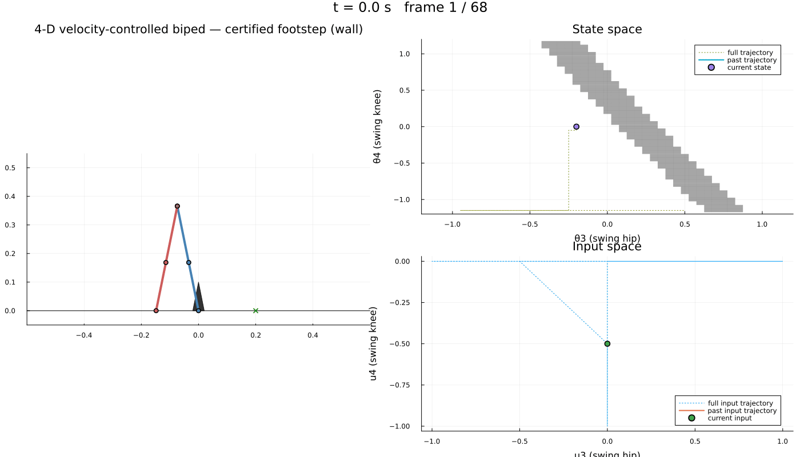{fig-align="center" width="100%"}
:::
::::
:::

## The abstraction is a bisimulation, not an over-approximation

::: {.vbody}
:::: {.columns .vcenter}
::: {.column width="56%"}
::: {style="font-size: 0.94em;"}
- Choose the grids **commensurable**: $\tau \cdot du = dx$. Every admissible
  input then translates the state grid exactly onto itself, so the reach set
  of a cell *is* a cell.
- No spurious transition, no non-determinism from discretization. The
  abstraction is a **bisimulation** of the concrete system, which is what
  makes `CENTER_SIMULATION` legitimate here: propagating the cell centre is
  unsound in general, exact under this choice of grids.
- **Between two samples.** Carving certifies cells; the solver only checks
  sampling instants. For $\dot x = u$ the inter-sample path is the straight
  segment, so `MP.cells_on_segment` enumerates every cell it crosses and
  `MP.swept_input_filter` keeps a transition only when all of them are
  admissible. That is what allows two speed levels per joint
  ($\pm 0.5, \pm 1.0$ rad/s) instead of one cell per step.
:::
:::
::: {.column width="44%"}
```{.julia style="font-size: 0.74em; line-height: 1.2;"}
dx, τ = 0.1, 0.1
du = dx / τ            ## one speed notch

state_grid = MP.GridFree(
    SVector(0.0, 0.0, 0.0, 0.0),
    SVector(dx, dx, dx, dx))
input_grid = MP.GridFree(
    SVector(0.0, 0.0, 0.0, 0.0),
    SVector(du, du, du, du))

@constraint(model, [i = 1:4], ∂(x[i]) == u[i])
set_attribute(model, "approx_mode",
    AB.UniformGridAbstraction.CENTER_SIMULATION)
```

```{=html}
<svg viewBox="0 0 560 258" style="width:100%; height:auto; display:block; margin:0.5em auto 0;" xmlns="http://www.w3.org/2000/svg">
  <defs>
    <marker id="bmarrow" viewBox="0 0 10 10" refX="9" refY="5" markerWidth="5" markerHeight="5" orient="auto-start-reverse">
      <path d="M 0 0 L 10 5 L 0 10 z" fill="#00449e"/>
    </marker>
  </defs>

  <text x="120" y="18" font-size="14" fill="#333" text-anchor="middle">a general grid</text>
  <g fill="#ffa6a6" opacity="0.55">
    <rect x="142" y="74" width="44" height="44"/><rect x="186" y="74" width="44" height="44"/>
    <rect x="142" y="118" width="44" height="44"/><rect x="186" y="118" width="44" height="44"/>
  </g>
  <rect x="54" y="118" width="44" height="44" fill="#ccf0ff"/>
  <g stroke="#bbb" stroke-width="1" fill="none">
    <path d="M10 30h220M10 74h220M10 118h220M10 162h220M10 206h220"/>
    <path d="M10 30v176M54 30v176M98 30v176M142 30v176M186 30v176M230 30v176"/>
  </g>
  <rect x="54" y="118" width="44" height="44" fill="none" stroke="#00449e" stroke-width="2"/>
  <ellipse cx="186" cy="118" rx="34" ry="28" fill="#00449e" opacity="0.18" stroke="#00449e" stroke-width="1.6" stroke-dasharray="4 3"/>
  <line x1="102" y1="138" x2="146" y2="126" stroke="#00449e" stroke-width="2" marker-end="url(#bmarrow)"/>
  <text x="120" y="230" font-size="13" fill="#333" text-anchor="middle">the true reach set spills</text>
  <text x="120" y="248" font-size="13" fill="#c0392b" text-anchor="middle">4 successors</text>

  <text x="440" y="18" font-size="14" fill="#333" text-anchor="middle">commensurable: τ·du = dx</text>
  <rect x="374" y="118" width="44" height="44" fill="#ccf0ff"/>
  <rect x="462" y="118" width="44" height="44" fill="#b3ffb3"/>
  <g stroke="#bbb" stroke-width="1" fill="none">
    <path d="M330 30h220M330 74h220M330 118h220M330 162h220M330 206h220"/>
    <path d="M330 30v176M374 30v176M418 30v176M462 30v176M506 30v176M550 30v176"/>
  </g>
  <rect x="374" y="118" width="44" height="44" fill="none" stroke="#00449e" stroke-width="2"/>
  <rect x="462" y="118" width="44" height="44" fill="none" stroke="#2a7d2a" stroke-width="2.4"/>
  <line x1="422" y1="140" x2="458" y2="140" stroke="#00449e" stroke-width="2" marker-end="url(#bmarrow)"/>
  <text x="440" y="134" font-size="12" fill="#00449e" text-anchor="middle">τ·u</text>
  <text x="440" y="230" font-size="13" fill="#333" text-anchor="middle">the reach set <tspan font-style="italic">is</tspan> a cell</text>
  <text x="440" y="248" font-size="13" fill="#2a7d2a" text-anchor="middle">1 successor, exact</text>
</svg>
```

::: {style="font-size: 0.62em;"}
Bounding $\tau$ by the obstacle *width* instead, the natural first idea, is
not sound: it forbids stepping over an obstacle yet still allows grazing a
corner between two free endpoints.
:::
:::
::::
:::

## Cartesian obstacles, pulled back to joint space

:::: {.columns .vcenter}
::: {.column width="54%"}
::: {style="font-size: 0.52em;"}
The constraints are not on the state. They live on the **swing foot position**,
a nonlinear image of it: the forward kinematics
$$g : \underbrace{\mathbb{R}^4}_{\text{4 joint angles } \theta}
\longrightarrow \underbrace{\mathbb{R}^2}_{\text{foot } (x,y) \text{ in the room}}.$$
The solver reasons about cells, not points, so each constraint is **pulled
back** with a Lipschitz margin: how far the foot can travel while $\theta$
stays inside one cell of centre $c$ and widths $h$,
$$\lVert g(\theta) - g(c) \rVert_\infty \le \sum_i L_i \frac{h_i}{2} =: \mathrm{dev}.$$
$L_i$ is a **lever arm**: the distance from joint $i$ to the foot. Read off the
chain, no differentiation, with $L_1 = 20.1$ cm hip-to-knee and $L_2 = 17.2$ cm
knee-to-foot; a hip carries both segments below it, a knee only the shank:
$$L = (\underbrace{L_1{+}L_2}_{\theta_1 \text{ st. hip}},\;
\underbrace{L_2}_{\theta_2 \text{ st. knee}},\;
\underbrace{L_1{+}L_2}_{\theta_3 \text{ sw. hip}},\;
\underbrace{L_2}_{\theta_4 \text{ sw. knee}}),
\qquad \textstyle\sum_i L_i = 1.09 \text{ m}.$$
The foot's displacement is the **sum of four vectors**, one per joint. Each
$L_i$ bounds its own vector exactly. What is **conservative** is the triangle
inequality on the sum: it holds with equality only if the four vectors were
aligned, and they are not, so they partly cancel. Measured on a cell: 3.8 cm of
real travel against 5.5 cm of bound.

- **Obstacle** $O$: remove a cell as soon as *some* configuration in it could
  reach $O$, that is $(g(c) \oplus [-\mathrm{dev},\mathrm{dev}]^2) \cap O \ne \emptyset$.
  Contrapositive, the certificate: a kept cell satisfies $g(\theta) \notin O$
  for **every** $\theta$ in it.
- **Ground**: a closed contact constraint, so a cell goes only when it is
  surely below the floor. Boundary cells are kept.
- The margin is an honest feasibility detector: at $dx = 0.1$ it is
  $\mathrm{dev} \approx 5.5$ cm and provably disconnects the free space, so no
  controller exists. At $dx = 0.05$ it drops to $\approx 2.7$ cm and the step
  becomes feasible, at about 2.5 M cells.
:::
:::
::: {.column width="46%"}
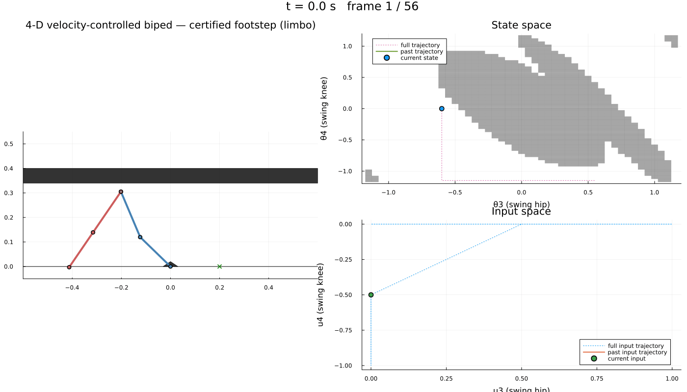{fig-align="center" width="82%" style="margin-bottom: -1.2em;"}

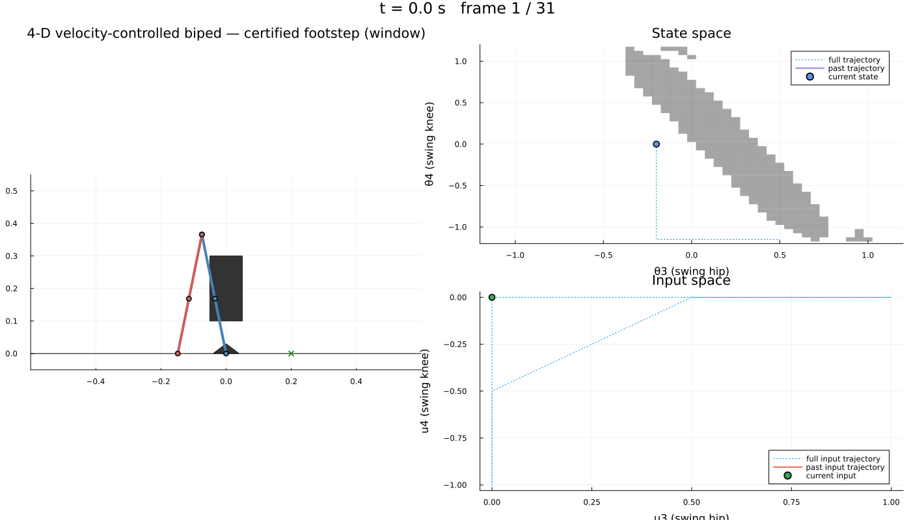{fig-align="center" width="82%" style="margin-bottom: -1.2em;"}

::: {style="font-size: 0.54em; text-align: center;"}
**limbo**: a bar at 0.34 m constrains the hip too, so the whole step happens
crouched. **window**: the foot threads a certified vertical slot.
:::
:::
::::

## Bounded input variation

::: {.vbody}
:::: {.columns .vcenter}
::: {.column width="50%"}
::: {style="font-size: 0.62em;"}
**The inputs are velocities**, so bounding the difference between consecutive
inputs is an **acceleration limit**: exactly what makes the profile trackable
by the motors, closing the loop with the first assumption.

$$d(u_{k-1}, u_k) \le \Delta \quad \text{along the whole run.}$$

- Collapsing the value table onto states alone loses paths whose upstream
  compatibility needs a locally more expensive input. So the value function is
  keyed on **pairs** $(q, u)$: Dijkstra on the *line graph*, the classical
  turn-restricted shortest path (Caldwell 1961), the same idea as the $\Delta u$
  state augmentation in MPC.
- The controller is therefore **dynamic**: its memory is the previously played
  input, and at $q$ with memory $u^-$ it plays the compatible input of least
  value.
- Here: one speed notch of change per joint per step, ramping from rest to
  rest. The measured maximum variation sits exactly **at** the bound, so the
  constraint is active along the whole run.
:::

```{=html}
<svg viewBox="0 0 430 196" style="width:62%; height:auto; display:block; margin:0.2em auto 0;" xmlns="http://www.w3.org/2000/svg">
  <defs>
    <marker id="bvarrow" viewBox="0 0 10 10" refX="9" refY="5" markerWidth="5" markerHeight="5" orient="auto-start-reverse">
      <path d="M 0 0 L 10 5 L 0 10 z" fill="#00449e"/>
    </marker>
  </defs>
  <g font-size="15" fill="#333" text-anchor="middle" font-style="italic">
    <text x="90" y="20">state q</text>
    <text x="320" y="20">state q′</text>
  </g>
  <g stroke="#00449e" stroke-width="2" marker-end="url(#bvarrow)">
    <line x1="112" y1="52" x2="294" y2="52"/>
    <line x1="110" y1="64" x2="292" y2="106"/>
  </g>
  <line x1="110" y1="68" x2="292" y2="152" stroke="#c0392b" stroke-width="2" stroke-dasharray="5 4"/>
  <text x="204" y="132" font-size="17" fill="#c0392b" text-anchor="middle">✗</text>
  <g stroke="#00449e" stroke-width="1.6" fill="#ccf0ff">
    <circle cx="90" cy="52" r="19"/><circle cx="90" cy="112" r="19"/><circle cx="90" cy="172" r="19"/>
    <circle cx="320" cy="52" r="19"/><circle cx="320" cy="112" r="19"/><circle cx="320" cy="172" r="19"/>
  </g>
  <g font-size="13" fill="#333" text-anchor="middle">
    <text x="90" y="57">+1</text><text x="90" y="117">0</text><text x="90" y="177">−1</text>
    <text x="320" y="57">+1</text><text x="320" y="117">0</text><text x="320" y="177">−1</text>
  </g>
  <text x="380" y="117" font-size="12" fill="#666" text-anchor="middle">input</text>
</svg>
```

::: {style="font-size: 0.58em; text-align: center;"}
A node of the dynamic program is a **pair**; an edge exists only when the two
inputs are within one notch.
:::
:::
::: {.column width="50%"}
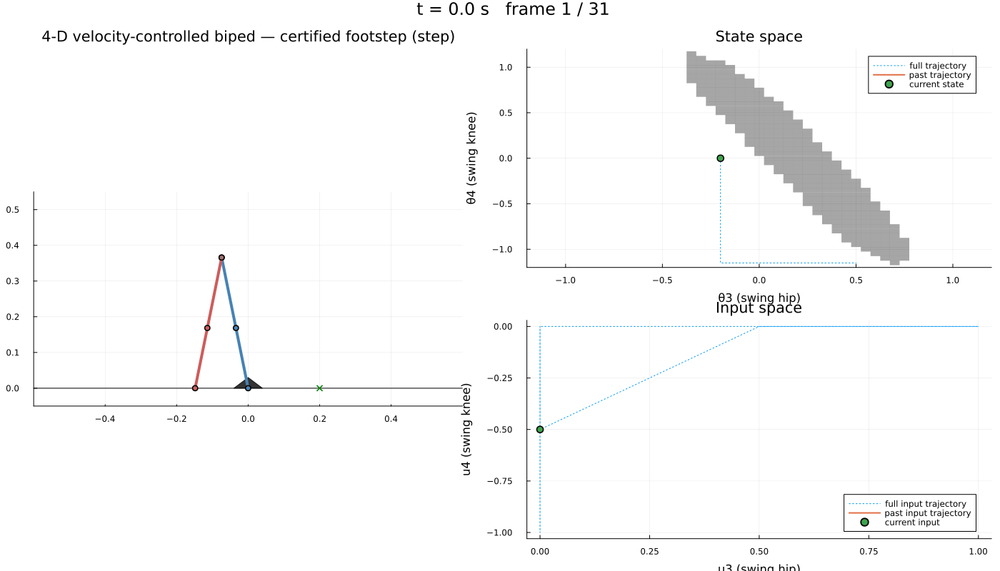{fig-align="center" width="100%"}

::: {style="font-size: 0.62em;"}
Bottom right panel, **input space** $(u_3, u_4)$: the commanded velocities move
one notch at a time and start and end at rest. That staircase is the
constraint, visible in the closed loop.
:::
:::
::::
:::

## Next improvements

::: {.vbody}
:::: {.columns .vcenter}
::: {.column width="56%"}
::: {style="font-size: 0.82em;"}
Turn each assumption into a constraint.

- **Tracking error** measured and re-imported as a disturbance: bisimulation
  becomes alternating simulation, still sound.
- **Balance**, absent from the specification today: the step from a certified
  footstep to a certified gait.
- **Friction cone** on the contact wrench instead of a pinned foot: another
  Cartesian condition, carved the same way as the obstacle.
- **Resolution.** 2.5 M cells at $dx = 0.05$, forced by the Lipschitz margin.
  A per-cell bound and lazy abstraction both attack it.
:::
:::
::: {.column width="44%"}
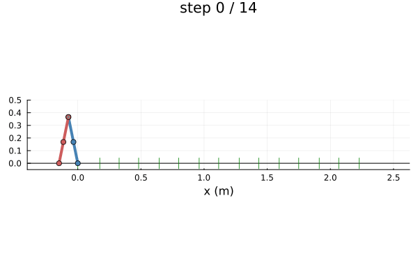{fig-align="center" width="100%"}

::: {style="font-size: 0.66em;"}
Multi-step walking already runs: the leg-swap reset maps grid cells onto grid
cells, so both stance phases share **one** abstraction and the specification is
a recurrence, $\pi(G) \subseteq \mathrm{Reach}(G)$, not safety.
:::
:::
::::
:::

# Next work {.section-slide}

## Next work

:::: {.columns}
::: {.column width="50%"}
::: {style="font-size: 0.66em;"}
**Release v0.2, end September**

- Coverage from 85 % to **90 %**.
- Another documentation pass.
- **Controller code generation**: export the lookup table and its certificate
  as standalone C, so a synthesized controller leaves the Julia session.

**Widen the front-end** (issue #597)

- Only 2 of about 10 solver families are reachable from a JuMP model today.
  Missing: PWA systems, ellipsoid templates and SDP sub-solvers, integer and
  binary variables, `@objective` costs, non-constant clock resets.

**Research direction**

- **Lazy abstractions**: build only the part of the state space the
  specification actually needs, instead of an a-priori uniform grid.
- **Hierarchical and multiscale abstractions**: coarse where the dynamics
  allow it, refined only where the controller fails.
:::
:::
::: {.column width="50%"}
::: {style="font-size: 0.66em;"}
**With people**

- **HSCC 2027 paper**, the experiment suite, with **Virginie**.
- A **paper on the certified trajectory pipeline**, with **Florentin Canart**
  and **Benoît Legat**: plan, refine, certify, and the funnel controller his
  thesis started.
- A dedicated **PCLF package**, extracted from Dionysos.jl into the Dionysos
  organization, with **Léa** and **Virginie**. The certificates and the
  path-complete machinery are useful well beyond abstraction.
- **From co-safe to full LTL**, with **Amir**: today the finite-trace fragment
  is exact; ω-regular specifications need Büchi acceptance and a fixed point
  on the product.
- **Robot speed control**, with **Riccardo** and **François**: discharge the
  tracking assumption, friction cone, balance.
- **Stochastic abstractions**, with **Adrien**: from $\forall w$ to interval
  MDPs and probabilistic guarantees, the natural home for a *learned* model.
- **GPU builds**, with **Benoît**: abstraction construction is embarrassingly
  parallel and we stop at threads, distributed and SLURM.
:::
:::
::::

::: {style="text-align: center; margin-top: 0.6em;"}
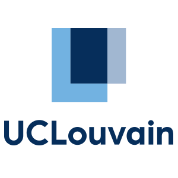{height=42} &nbsp;&nbsp;
{height=42} &nbsp;&nbsp;
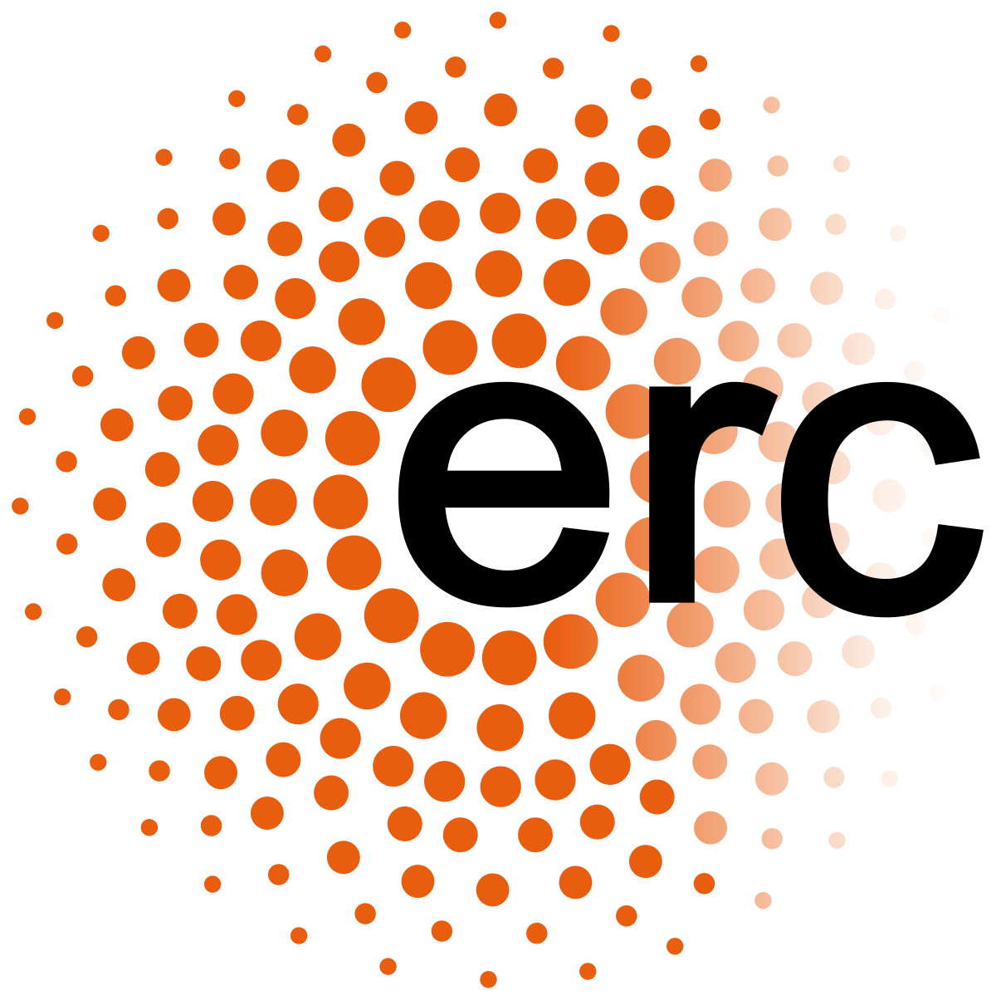{height=42} &nbsp;&nbsp;
{height=42} &nbsp;&nbsp;
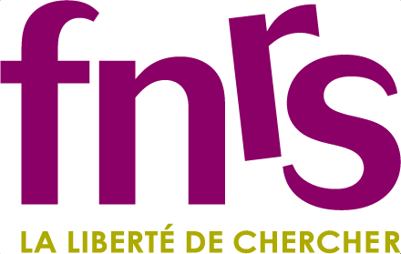{height=42} &nbsp;&nbsp;
{height=42}
:::

# Thanks for your attention {.section-slide}

:::: {.columns}
::: {.column width="33%"}
{height=190}

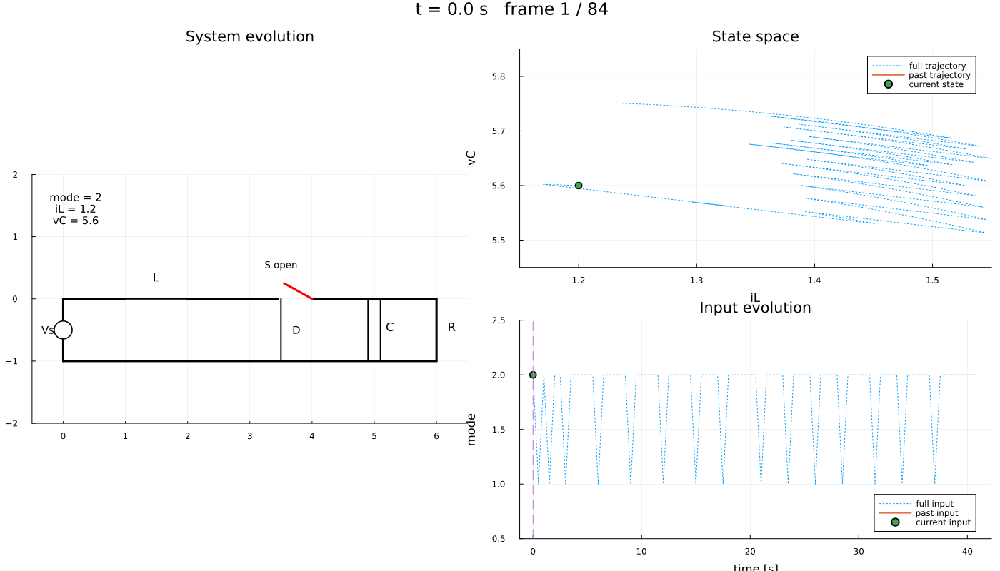{height=190}
:::
::: {.column width="33%"}
{height=190}

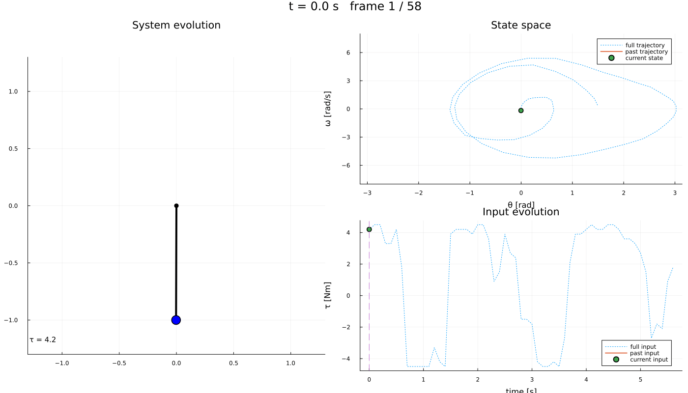{height=190}
:::
::: {.column width="33%"}
{height=190}

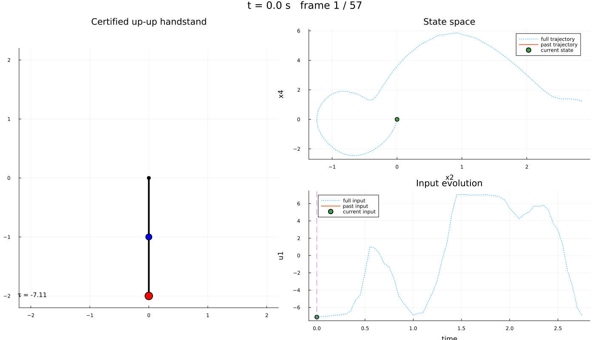{height=190}
:::
::::

::: {style="text-align: center; font-size: 0.6em; margin-top: -0.4em;"}
One convention, `system_plot!` + `animate_trajectory_dashboard`, animates every
benchmark, continuous or hybrid.
:::

## Annex: what a toolbox like ours could still have

::: {style="font-size: 0.62em;"}
Checked against `src/`: no stochastic abstraction, no MDP, no BDD, no GPU, no
code generation today.
:::

:::: {.columns .vtop}
::: {.column width="50%"}
::: {style="font-size: 0.6em;"}
**Modelling coverage**

- **Stochastic systems.** Everything is worst-case, $\forall w$. Interval MDPs,
  PCTL, guarantees of the form *satisfied with probability $\ge 0.95$*, the
  territory of AMYTISS, StocHy, SReachTools. The natural home for a model that
  was *learned* rather than derived, so the closest to the ERC's own question.
- **STL with quantitative semantics.** Co-safe LTL is boolean. Robustness gives
  a margin instead of a yes or no, which is what the cyber-physical community
  actually optimizes.

**Scale**

- **BDD transition relation.** We store explicit lists: 9.7 M transitions for
  path planning. SCOTS encodes the same thing in CUDD, often orders of
  magnitude smaller on structured dynamics, and a BDD factorizes a synchronized
  product with a finite factor, which is exactly what our lifts are.
- **GPU builds.** Threaded, distributed and SLURM exist; nothing on GPU.
  Abstraction construction is embarrassingly parallel, which is the whole point
  of pFaces.
- **Saving and reloading abstractions** (#502). Recomputing 2.5 M cells every
  session is absurd.
:::
:::
::: {.column width="50%"}
::: {style="font-size: 0.6em;"}
**Reaching users**

- **Controller code generation.** We synthesize a controller that lives in a
  Julia session. Exporting the lookup table plus its certificate as standalone
  C is what turns *usable by a company with no controls team* from a slogan
  into a fact. Cheapest item on this list.
- **Cross-tool benchmarking.** Our central claim is *swap the solver, compare*,
  and we never run it against **other tools**: SCOTS, ROCS, pFaces,
  OmegaThreads. That comparison is the external validation the framing is
  missing.

**Certificate quality**

- **Rounding-sound arithmetic end to end.** We say correct-by-construction, but
  growth bounds go through floating point without systematic outward rounding;
  `IntervalArithmetic` is used only inside the Symbolics extension. A formal
  reviewer will ask.

**Front-end**

- The `#597` list: PWA systems, ellipsoid templates and SDP sub-solvers,
  integers and binaries, `@objective` costs, non-constant clock resets.
:::
:::
::::
